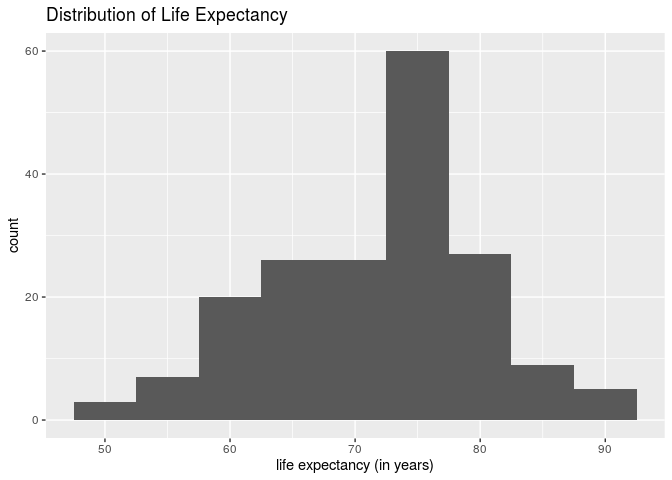
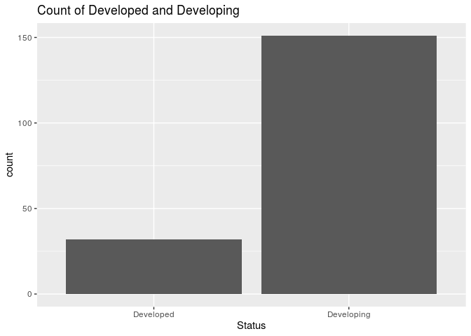
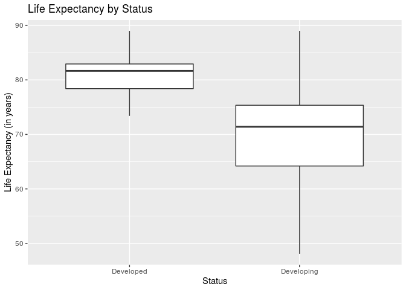
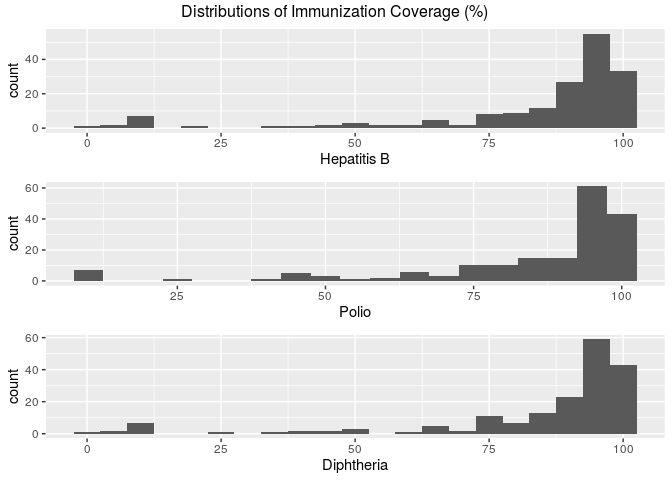
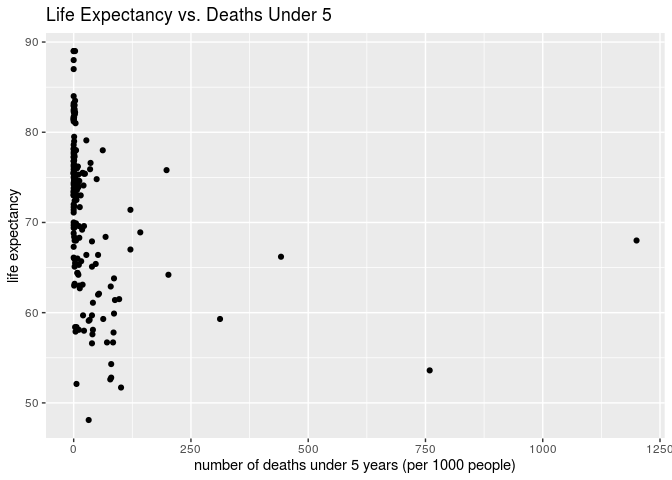
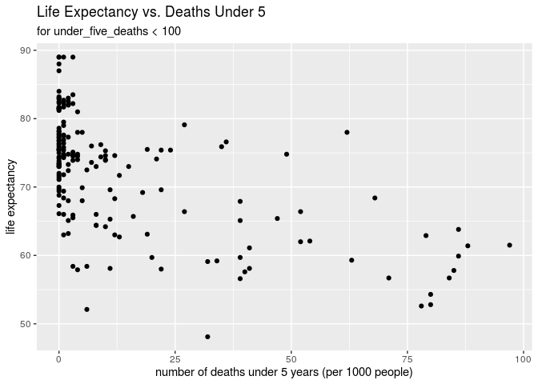
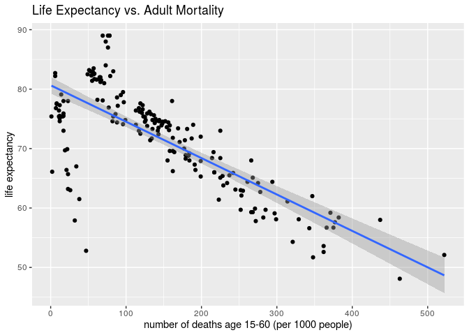
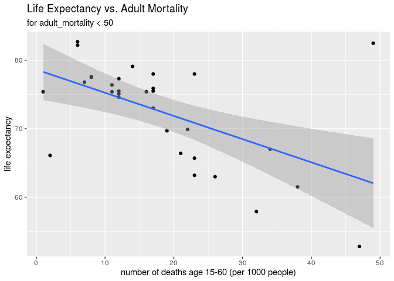
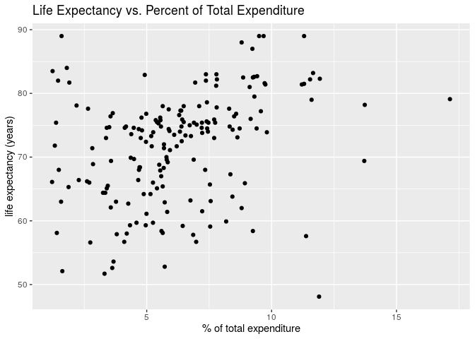

Life Expectancy Across Nations
================
Dressed to the 9’s
October 30, 2019

``` r
library(tidyverse)
library(skimr)
library(gridExtra)
```

## Section 1. Introduction

Extensive research has been done to identify the many factors that
influence life expectancy, such as demographic variables, income
composition, and mortality rates. However, less research has surfaced
identifying causes such as immunizations, which is a very important
factor to consider when studying life expectancy due to the high
incidence of infectious disease leading to mortality and morbidity. The
World Health Organization (WHO) states that vaccination greatly reduces
the burden of infectious diseases on a country itself. Therefore,
reducing the burden of infectious diseases is important to increasing a
country’s average life expectancy.

This dataset comes from the Global Health Observatory (GHO) data from
the WHO. The data attempts to identify significant factors that may have
an influence on a country’s life expectancy, including information on
nations’ immunization factors, mortality factors, economic factors, and
other health-related factors. The dataset includes data from 193
countries across the years 2000- 2015; however, we have filtered the
data to focus specifically on data from 183 countries within the year
2014 that may influence life expectancy. Life expectancy is reported in
the data as the average age for each country. Therefore, countries can
use this information to determine what is most important for them to
focus on improving in order to improve overall life expectancy.

Initially, we want to discover if there is a statistically significant
difference between region and life expectancy. To investigate this
potential relationship, we will create a new variable called ‘region’ to
classify each country into its geographic region. We expect that we will
see significant differences across regions, and if there are differences
present, we will then investigate which regions have significantly
different life expectancies than the others.

Our aim is to build a model using multinomial regression that will
identify which predictors from the WHO data are the most significant
predictors of a nation’s life expectancy in the year 2014. We expect
that predictors involving data on a nation’s immunizations (predictor
variables Hepatitis B, HIV/AIDS, Polio, Diphtheria, and Measles) will be
more significant predictors of life expectancy for the year 2014, rather
than predictors involving mortality factors, economic factors, and other
health-related factors, because these predictors relate directly to the
burden of infectious diseases.

However, there may be a difference between the significance of
immunizations in developing countries versus developed countries where
most of the population is already vaccinated. We expect that in
developing countries, where there is a high burden of disease due to
infectious diseases, immunizations will be more significant predictors
of life expectancy than in developed countries, where the burden of
disease is concentrated in non-communicable diseases rather than
infectious diseases. To investigate this, we intend to explore the
potential relationship between the life expectancies of countries
classified as “developed” versus countries classified as “developing”
using ANOVA, and we expect to find a significant difference between
these two groups.

## Section 2. Exploratory Data Analysis

``` r
lifedata <- read_csv("data/life.csv")

lifedata <- lifedata%>%
  filter(year == 2014)
```

### Overall Description

The health-related data in this dataset was collected by the Global
Health Observatory (GHO) data repository under World Health Organization
(WHO). The economic data for each country was first reported on the
United Nations website.

Before the merged dataset was reported on Kaggle, a few countries (such
as Vanuatu, Tonga, Togo, and Cabo Verde) were removed because these
observations were missing data for most of the variables.

While the Kaggle dataset included individual observations for each
country for each year from 2000-2015, we will only explore the data for
the year 2014 in order to narrow the focus and scope of our analysis.

Therefore, our final dataset will include 183 observations and 22
columns. Each observation represents a different world country for the
year 2014.

### Response Variable

The response variable is the life expectancy of a country in years of
age.

Its variable type is double.

``` r
ggplot(data = lifedata, mapping = aes(x = life_expectancy))+
  geom_histogram(binwidth = 5)+
  labs(title = "Distribution of Life Expectancy", x = "life expectancy (in years)")
```

<!-- -->

This variable is unimodal and centered approximtely around 75 years.

### Predictor Variables

There are 17 predictor variables that we are considering for our model.
Status characterizes a country as developed or developing. Adult
Mortality is the mortality rates of both sexes, the probability of dying
between 15 and 60. Infant deaths is the number of infant deaths per 1000
population. Alcohol is the alcohol consumption, recorded per capita of
15+. Percentage expenditure is the expenditure on health as a percentage
of GDP/capita, as a percentage. Hepatitis B is the HepB immunization
coverage among 1 year olds, as a percentage. Measles is the number of
reported cases per 1000 population. BMI is the average body mass index
of the population. Under-five-deaths is the amount of under-five-deaths
per 1000 population. Polio is the Pol3 immunization coverage among 1
year olds, as a percentage. Total expenditure is government expenditure
on health as a percentage of total government expenditure. Diphtheria is
the DTP3 immunization coverage among 1 year olds, as a percentage.
HIV/AIDS is the deaths per 1000 live births with HIV/AIDS, from 0-4
years. GDP is the gross domestic product per capita, in dollars.
Thinness 10-19 years is the prevalence of thinness among children age
10-19, as a percentage. Thinness 5-9 years is the prevalence of thinness
among children age 5-9, as a percentage. Schooling is the number of
years of schooling.

### Any Other Variables

There are a few variables that we are not using as predictors of life
expectancy. Population of the country won’t help us predict life
expectancy. We are also not including income composition of recources
because because this is the Human Development Index in terms of income
composition of resources (index ranging from 0 to 1) and we do not
expect this variable to have a significant effect on life expectancy.

### Preliminary EDA

``` r
lifedata%>%
  skim()
```

    ## Skim summary statistics
    ##  n obs: 183 
    ##  n variables: 22 
    ## 
    ## ── Variable type:character ───────────────────────────────────────────────
    ##  variable missing complete   n min max empty n_unique
    ##   country       0      183 183   4  52     0      183
    ##    status       0      183 183   9  10     0        2
    ## 
    ## ── Variable type:numeric ─────────────────────────────────────────────────
    ##               variable missing complete   n        mean          sd
    ##        adult_mortality       0      183 183   148.69      106.03   
    ##                alcohol       1      182 183     3.27        4.16   
    ##                    bmi       2      181 183    41.03       21.11   
    ##             diphtheria       0      183 183    84.08       23.03   
    ##                    gdp      28      155 183 10015.57    18484.24   
    ##            hepatitis_b      10      173 183    83.12       23.36   
    ##               hiv/aids       0      183 183     0.68        1.39   
    ##  income_comp_resources      10      173 183     0.69        0.15   
    ##          infant_deaths       0      183 183    24.56       87.05   
    ##        life_expectancy       0      183 183    71.54        8.56   
    ##                measles       0      183 183  1831.21     8770.08   
    ##       perc_expenditure       0      183 183  1001.91     2553.29   
    ##                  polio       0      183 183    84.73       20.87   
    ##             population      41      142 183     2.1e+07     1.1e+08
    ##              schooling      10      173 183    12.89        2.91   
    ##    thinness_1-19_years       2      181 183     4.53        4.14   
    ##     thinness_5-9_years       2      181 183     4.68        4.25   
    ##      total_expenditure       2      181 183     6.2         2.74   
    ##      under_five_deaths       0      183 183    32.89      114.29   
    ##                   year       0      183 183  2014           0      
    ##       p0       p25        p50        p75         p100     hist
    ##     1        66        135        216.5     522       ▇▇▇▃▂▂▁▁
    ##     0.01      0.01       0.32       6.7      15.19    ▇▁▁▂▁▁▁▁
    ##     2        23.2       47.4       59.8      77.1     ▃▂▅▂▂▅▇▁
    ##     2        83         94         97        99       ▁▁▁▁▁▁▁▇
    ##    12.28    617.99    3154.51    8239.95 119172.74    ▇▁▁▁▁▁▁▁
    ##     2        79         93         97        99       ▁▁▁▁▁▁▁▇
    ##     0.1       0.1        0.1        0.4       9.4     ▇▁▁▁▁▁▁▁
    ##     0.34      0.57       0.72       0.8       0.94    ▂▃▃▃▃▇▅▅
    ##     0         0          2         18       957       ▇▁▁▁▁▁▁▁
    ##    48.1      65.6       73.6       76.85     89       ▁▂▃▃▃▇▃▁
    ##     0         0         13        316     79563       ▇▁▁▁▁▁▁▁
    ##     0        11.06     151.1      703.21  19479.91    ▇▁▁▁▁▁▁▁
    ##     8        80         94         97        99       ▁▁▁▁▁▁▂▇
    ##    41    286943.75 1567720    8080433         1.3e+09 ▇▁▁▁▁▁▁▁
    ##     4.9      10.8       13         14.9      20.4     ▁▂▅▅▇▆▂▁
    ##     0.1       1.5        3.3        6.6      26.8     ▇▃▂▁▁▁▁▁
    ##     0.1       1.5        3.4        6.6      27.4     ▇▃▂▁▁▁▁▁
    ##     1.21      4.48       5.84       7.74     17.14    ▃▆▇▆▂▁▁▁
    ##     0         0          3         22      1200       ▇▁▁▁▁▁▁▁
    ##  2014      2014       2014       2014      2014       ▁▁▁▇▁▁▁▁

As seen in the summary statistics, there are 183 observations and 22
variables. While some variables have some missing data, every country
has a value for life expectancy, of which the average is 71.54 years.

We can first examine the status variable which indicates if a country is
developed or developing:

``` r
ggplot(lifedata, aes(x = status))+
  geom_bar()+
  labs(title = "Count of Developed and Developing", x = "Status")
```

<!-- -->

``` r
lifedata%>%
  count(status)
```

    ## # A tibble: 2 x 2
    ##   status         n
    ##   <chr>      <int>
    ## 1 Developed     32
    ## 2 Developing   151

As seen in the bar graph above, there are many more developing countries
than developed (151 vs. 32).

Additionally, we can examine boxplots of life expectancy for each of
these two groups:

``` r
ggplot(lifedata, aes(x = status, y = life_expectancy))+
  geom_boxplot()+
  labs(title = "Life Expectancy by Status", x = "Status",
       y = "Life Expectancy (in years)")
```

<!-- -->

Preliminarily, these boxplots show that generally, developed countries
have higher life expectancy than developing countries.

We would also like to examine immunization coverage for Hepatitis B,
Polio, and Diphtheria. This is reported in terms of percent of
1-year-olds who are immunized.

``` r
p1 <- ggplot(lifedata, aes(x = hepatitis_b))+
  geom_histogram(binwidth = 5)+
  labs(x = "Hepatitis B")

p2 <- ggplot(lifedata, aes(x = polio))+
  geom_histogram(binwidth = 5)+
  labs(x = "Polio")

p3 <- ggplot(lifedata, aes(x = diphtheria))+
  geom_histogram(binwidth = 5)+
  labs(x = "Diphtheria")

grid.arrange(p1, p2, p3, top = "Distributions of Immunization Coverage (%) ")
```

<!-- -->

From these histograms it is evident that in most countries, most
1-year-olds are immunized for these diseases. However, for all the
diseases there are still a few countries with almost a 0% immunization
coverage, which likely affects life expectancy.

Another interesting variable records the number of under-five deaths per
1000 people in the population. This can be plotted against life
expectancy to better understand the relationship between the two
variables:

``` r
ggplot(lifedata, aes(x = under_five_deaths, y = life_expectancy))+
  geom_point()+
  labs(title = "Life Expectancy vs. Deaths Under 5", 
       x = "number of deaths under 5 years (per 1000 people)", 
       y = "life expectancy")
```

<!-- -->

``` r
under_five_data <- lifedata%>%
  filter(under_five_deaths < 100)

ggplot(under_five_data, aes(x = under_five_deaths, y = life_expectancy))+
  geom_point()+
  labs(title = "Life Expectancy vs. Deaths Under 5", 
       subtitle = "for under_five_deaths < 100", 
       x = "number of deaths under 5 years (per 1000 people)", 
       y = "life expectancy")
```

<!-- -->

Even when the number of deaths under age 5 is restricted to less than
100 (in the second plot), there surprisingly still seems to be a weak
correlation between under\_five\_deaths and life\_expectancy.

Perhaps an adult mortality rate will yield less surprising results when
compared to life expectancy. This variable shows the mortality rate of
both sexes (probability of dying between 15 and 60 years per 1000
population).

``` r
ggplot(lifedata, aes(x = adult_mortality, y = life_expectancy))+
  geom_point()+
  labs(title = "Life Expectancy vs. Adult Mortality", 
       x = "number of deaths age 15-60 (per 1000 people)", 
       y = "life expectancy")+
  geom_smooth(method = lm)
```

<!-- -->

``` r
mortality_data <- lifedata%>%
  filter(adult_mortality < 50)

ggplot(mortality_data, aes(x = adult_mortality, y = life_expectancy))+
  geom_point()+
  labs(title = "Life Expectancy vs. Adult Mortality", 
       subtitle = "for adult_mortality < 50", 
       x = "number of deaths age 15-60 (per 1000 people)", 
       y = "life expectancy")+
  geom_smooth(method = lm)
```

<!-- -->

For adult mortality, as opposed to child mortality, two linear trends
become obvious. One shows a negative correlation spanning from 0-500
adult deaths per 1000 people and the other is contained within the range
of 0-50 adult deaths.

We can also examine government-related variables and their relationship
with life expectancy, such as total\_expenditure which measures the
percent of total government expenditure spent on health:

``` r
ggplot(lifedata, aes(x = total_expenditure, y = life_expectancy))+
  geom_point()+
  labs(title = "Life Expectancy vs. Percent of Total Expenditure",
       x = "% of total expenditure", y = "life expectancy (years)")
```

    ## Warning: Removed 2 rows containing missing values (geom_point).

<!-- -->

The relationship between these two variables appears to be weakly
positive.

## Section 3. Regression Analysis Plan

### Interactions

In our regression analysis, we would like to first examine the
relationship between region and life expectancy. We plan to create a new
variable to classify each country into its geographic region, and then
we will conduct an ANOVA test to discover if life expectancy varies
across regions. If differences are present, we will utilize pairwise
confidence intervals and confidence interval plots to determine which
regions have significantly different life expectancies from others.

Then, we expect that the status of a country (Developed vs. Developing)
may also have an effect on life expectancy, as developing countries have
less resources and are generally less stable than fully developed
countries. We will perform a second ANOVA test to examine if there is a
significant difference in life expectancy between developed and
developing countries.

Finally, we will investigate which country characteristics are the best
predictors of life expectancy in a given country. First, we will create
a new categorical variable to classify life expectancy: 48 years to 55
years will be considered poor, 55 years to 66 years will be considered
fair, 66 years to 77 years will be considered good, and 77 years to 90
years will be considered excellent. We will use a multinomial logistic
regression model to explore the effects of each country characteristic
on the probability that the given country will have a certain category
of life expectancy.

We will begin by utilizing most variables in the dataset, including
adult mortality, infant deaths, schooling, GDP, population, total
expenditure, and BMI. We suspect that the influence of certain
predictors, such as HIV/AIDS, polio, diptheria, and hepatitis B, may
differ depending on geographic location (i.e. life expectancy in
countries with readily available vaccine supplies may not be as affected
by these diseases as life expectancy in countries without readily
available vaccines). To address this, when fitting our model, we will
calculate the interaction effect of region on HIV/AIDS, polio,
diptheria, and hepatitis B.

### Model Selection

To create and improve our model, we will use backwards selection based
on Schwarz’s Bayesian Information Criterion, or BIC. We will begin with
all possible variables that we are considering as potentially
significant to life expectancy category, status, adult mortality, infant
deaths, alcohol, percentage expenditure, hepatitis B, measles, BMI,
under-five-deaths, polio, total expenditure, diphtheria, HIV/AIDS, GDP,
thinness 10-19 years, thinness 5-9 years, and schooling. We will
continually remove variables and select the model with the lowest BIC.
We selected this criterion because the BIC possesses a larger penalty
for unnecessary predictors than the AIC and adjusted R<sup>2</sup>, so
it will result in a more parsimonious model. To make our model more
useful and easier to understand, we want it to possess a lower number of
significant predictors, which is accomplished by the BIC.

### Modeling Technique

To create our model, we will use multinomial regression to display the
effects of country characteristics on the odds that a country will have
a certain category of life expectancy (poor, fair, good, or excellent).
We chose this technique because we wanted to see the effects of multiple
variables on a categorical response with several levels – this could not
be accomplished by simple linear regression, multiple linear regression,
or logistic regression. We believe that when investigating countries
that are in need of global assistance, the exact life expectancy is not
required – rather, simply knowing if the life expectancy is very
low/high is sufficient for recognizing a struggling nation. We believe
multinomial linear regression will allow us to utilize quantitative
characteristics of different countries to predict an important
categorical response.

We will use ANOVA for preliminary investigation of whether life
expectancy differs between regions. ANOVA allows us to see if a response
variable is generally equal across categories or if it differs, and if
life expectancy varies across regions, this is a good indicator to study
other characteristics of region with high and low life expectancies to
see what may be influencing life expectancy. We are also using the
interaction effect technique to discover how differences in region may
affect the influence of certain diseases on a country’s life expectancy,
as this technique allows us to control the influence (coefficients) of
certain diseases in our model if it is significantly different over
regions.

## Section 4. References

Help with the gridExtra package and grid.arrange()
function:

<https://cran.r-project.org/web/packages/gridExtra/vignettes/arrangeGrob.html#title-andor-annotations>

Introduction:

WHO | Vaccination greatly reduces disease, disability, death and
inequity worldwide. (n.d.). Retrieved October 29, 2019, from WHO
website: <https://www.who.int/bulletin/volumes/86/2/07-040089/en/>

## The Data

<https://www.kaggle.com/kumarajarshi/life-expectancy-who>

``` r
glimpse(lifedata)
```

    ## Observations: 183
    ## Variables: 22
    ## $ country               <chr> "Afghanistan", "Albania", "Algeria", "Ango…
    ## $ year                  <dbl> 2014, 2014, 2014, 2014, 2014, 2014, 2014, …
    ## $ status                <chr> "Developing", "Developing", "Developing", …
    ## $ life_expectancy       <dbl> 59.9, 77.5, 75.4, 51.7, 76.2, 76.2, 74.6, …
    ## $ adult_mortality       <dbl> 271, 8, 11, 348, 131, 118, 12, 6, 66, 119,…
    ## $ infant_deaths         <dbl> 64, 0, 21, 67, 0, 8, 1, 1, 0, 5, 0, 0, 98,…
    ## $ alcohol               <dbl> 0.01, 4.51, 0.01, 8.33, 8.56, 7.93, 3.91, …
    ## $ perc_expenditure      <dbl> 73.52358, 428.74907, 54.23732, 23.96561, 2…
    ## $ hepatitis_b           <dbl> 62, 98, 95, 64, 99, 94, 93, 91, 98, 94, 96…
    ## $ measles               <dbl> 492, 0, 0, 11699, 0, 1, 13, 340, 117, 0, 0…
    ## $ bmi                   <dbl> 18.6, 57.2, 58.4, 22.7, 47.0, 62.2, 54.1, …
    ## $ under_five_deaths     <dbl> 86, 1, 24, 101, 0, 9, 1, 1, 0, 6, 0, 0, 12…
    ## $ polio                 <dbl> 58, 98, 95, 68, 96, 92, 95, 92, 98, 97, 96…
    ## $ total_expenditure     <dbl> 8.18, 5.88, 7.21, 3.31, 5.54, 4.79, 4.48, …
    ## $ diphtheria            <dbl> 62, 98, 95, 64, 99, 94, 93, 92, 98, 94, 96…
    ## $ `hiv/aids`            <dbl> 0.1, 0.1, 0.1, 2.0, 0.2, 0.1, 0.1, 0.1, 0.…
    ## $ gdp                   <dbl> 612.6965, 4575.7638, 547.8517, 479.3122, 1…
    ## $ population            <dbl> 327582, 288914, 39113313, 2692466, NA, 429…
    ## $ `thinness_1-19_years` <dbl> 17.5, 1.2, 6.0, 8.5, 3.3, 1.0, 2.1, 0.6, 1…
    ## $ `thinness_5-9_years`  <dbl> 17.5, 1.3, 5.8, 8.3, 3.3, 0.9, 2.1, 0.6, 2…
    ## $ income_comp_resources <dbl> 0.476, 0.761, 0.741, 0.527, 0.782, 0.825, …
    ## $ schooling             <dbl> 10.0, 14.2, 14.4, 11.4, 13.9, 17.3, 12.7, …
