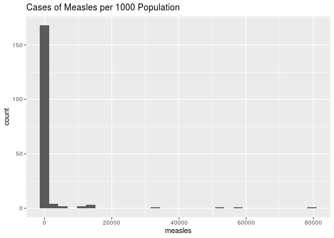

Life Expectancy Across Nations
================
Dressed to the 9’s
November 20, 2019

### Load Packages

### Research Question and Modeling Objective

We intend to use this data in order to discover the differences in life
expectancies across countries. Life expectancy is reported in the data
as the average age for each country. Therefore, countries can use this
information to determine what is most important for them to focus on
improving in order to improve overall life expectancy.  
Our aim is to investigate which country characteristics are the best
predictors of life expectancy in a given country in the year 2014.
First, we will create a new categorical variable to classify life
expectancy: 48 years to 60 years will be considered poor, 61 years to 67
years will be considered fair, 68 years to 76 years will be considered
good, and 77 years to 90 years will be considered excellent. These
thresholds are chosen based on the distribution of life expectancy: the
minimum to 25th percentile is 48.1 years to 65.6 years, informing our
choice of 48 year to 60 years for poor. The 25th to 75th percentile is
65.6 to 76.5, informing our choice of 61 years to 67 years for fair and
68 years to 76 years for good. Finally, the 75th percentile to maximum
is 76.85 years to 89 years, informing our choice of 77 years to 90 years
for excellent.

We will use a multinomial logistic regression model to explore the
effects of each country characteristic on the probability that the given
country will have a certain category of life expectancy in 2014. We
expect that predictors involving data on a nation’s immunizations
(predictor variables Hepatitis B, HIV/AIDS, Polio, Diphtheria, and
Measles) will be more significant predictors of life expectancy for the
year 2014, rather than predictors involving mortality factors, economic
factors, and other health-related factors, because these predictors
relate directly to the burden of infectious diseases.  
However, there may be a difference between the significance of
immunizations in developing countries versus developed countries where
most of the population is already vaccinated. We expect that in
developing countries, where there is a high burden of disease due to
infectious diseases, immunizations will be more significant predictors
of life expectancy than in developed countries, where the burden of
disease is concentrated in non-communicable diseases rather than
infectious diseases. To investigate this, we intend to explore the
potential relationship between the life expectancies of countries
classified as “developed” versus countries classified as “developing”
using ANOVA, and we expect to find a significant difference between
these two groups.

### Response Variable

The response variable is the life expectancy of a country in years of
age. Its variable type is double.

<!-- -->

This variable is unimodal and centered approximtely around 75 years.

We are going to create a new categorical variable to classify life
expectancy in which: 48 years to 60 years will be considered poor, 61
years to 67 years will be considered fair, 68 years to 76 years will be
considered good, and 77 years to 90 years will be considered excellent.

    ## 
    ## Skim summary statistics
    ## 
    ## ── Variable type:factor ─────────────────────────────────────────────────
    ##                      variable missing complete   n n_unique
    ##  lifedata$life_expectancy_cat       0      183 183        4
    ##                          top_counts ordered
    ##  goo: 75, exc: 53, fai: 30, poo: 25   FALSE

This new variable life\_expectancy\_cat will be used as the response
variable for our model. This variable is a categorical variable with 4
different
levels.

<!-- -->

From the plot, we can see that most countries have life expectancies
categorized as good.

### Updated Exploratory Data Analysis

##### Overall Description of Data

The health-related data in this dataset was collected by the Global
Health Observatory (GHO) data repository under World Health Organization
(WHO). The economic data for each country was first reported on the
United Nations website.

Before the merged dataset was reported on Kaggle, a few countries (such
as Vanuatu, Tonga, Togo, and Cabo Verde) were removed because these
observations were missing data for most of the variables.

While the Kaggle dataset included individual observations for each
country for each year from 2000-2015, we will only explore the data for
the year 2014 in order to narrow the focus and scope of our analysis.

Therefore, our final dataset will include 183 observations and 22
columns. Each observation represents a different world country for the
year 2014.

    ## Skim summary statistics
    ##  n obs: 183 
    ##  n variables: 23 
    ## 
    ## ── Variable type:character ──────────────────────────────────────────────
    ##  variable missing complete   n min max empty n_unique
    ##   country       0      183 183   4  52     0      183
    ##    status       0      183 183   9  10     0        2
    ## 
    ## ── Variable type:factor ─────────────────────────────────────────────────
    ##             variable missing complete   n n_unique
    ##  life_expectancy_cat       0      183 183        4
    ##                          top_counts ordered
    ##  goo: 75, exc: 53, fai: 30, poo: 25   FALSE
    ## 
    ## ── Variable type:numeric ────────────────────────────────────────────────
    ##               variable missing complete   n        mean          sd
    ##        adult_mortality       0      183 183   148.69      106.03   
    ##                alcohol       1      182 183     3.27        4.16   
    ##                    bmi       2      181 183    41.03       21.11   
    ##             diphtheria       0      183 183    84.08       23.03   
    ##                    gdp      28      155 183 10015.57    18484.24   
    ##            hepatitis_b      10      173 183    83.12       23.36   
    ##               hiv_aids       0      183 183     0.68        1.39   
    ##  income_comp_resources      10      173 183     0.69        0.15   
    ##          infant_deaths       0      183 183    24.56       87.05   
    ##        life_expectancy       0      183 183    71.54        8.56   
    ##                measles       0      183 183  1831.21     8770.08   
    ##       perc_expenditure       0      183 183  1001.91     2553.29   
    ##                  polio       0      183 183    84.73       20.87   
    ##             population      41      142 183     2.1e+07     1.1e+08
    ##              schooling      10      173 183    12.89        2.91   
    ##         thinness_10_19       2      181 183     4.53        4.14   
    ##           thinness_5_9       2      181 183     4.68        4.25   
    ##      total_expenditure       2      181 183     6.2         2.74   
    ##      under_five_deaths       0      183 183    32.89      114.29   
    ##                   year       0      183 183  2014           0      
    ##       p0       p25        p50        p75         p100     hist
    ##     1        66        135        216.5     522       ▇▇▇▃▂▂▁▁
    ##     0.01      0.01       0.32       6.7      15.19    ▇▁▁▂▁▁▁▁
    ##     2        23.2       47.4       59.8      77.1     ▃▂▅▂▂▅▇▁
    ##     2        83         94         97        99       ▁▁▁▁▁▁▁▇
    ##    12.28    617.99    3154.51    8239.95 119172.74    ▇▁▁▁▁▁▁▁
    ##     2        79         93         97        99       ▁▁▁▁▁▁▁▇
    ##     0.1       0.1        0.1        0.4       9.4     ▇▁▁▁▁▁▁▁
    ##     0.34      0.57       0.72       0.8       0.94    ▂▃▃▃▃▇▅▅
    ##     0         0          2         18       957       ▇▁▁▁▁▁▁▁
    ##    48.1      65.6       73.6       76.85     89       ▁▂▃▃▃▇▃▁
    ##     0         0         13        316     79563       ▇▁▁▁▁▁▁▁
    ##     0        11.06     151.1      703.21  19479.91    ▇▁▁▁▁▁▁▁
    ##     8        80         94         97        99       ▁▁▁▁▁▁▂▇
    ##    41    286943.75 1567720    8080433         1.3e+09 ▇▁▁▁▁▁▁▁
    ##     4.9      10.8       13         14.9      20.4     ▁▂▅▅▇▆▂▁
    ##     0.1       1.5        3.3        6.6      26.8     ▇▃▂▁▁▁▁▁
    ##     0.1       1.5        3.4        6.6      27.4     ▇▃▂▁▁▁▁▁
    ##     1.21      4.48       5.84       7.74     17.14    ▃▆▇▆▂▁▁▁
    ##     0         0          3         22      1200       ▇▁▁▁▁▁▁▁
    ##  2014      2014       2014       2014      2014       ▁▁▁▇▁▁▁▁

As seen in the summary statistics, there are 183 observations and 22
variables. While some variables have some missing data, every country
has a value for life expectancy, of which the average is 71.54 years.

##### Univariate Distributions of Predictor Variables

We can first examine the status variable which indicates if a country is
developed or developing:

<!-- -->

    ## # A tibble: 2 x 2
    ##   status         n
    ##   <chr>      <int>
    ## 1 Developed     32
    ## 2 Developing   151

As seen in the bar graph above, there are many more developing countries
than developed (151 vs. 32).

We would also like to examine immunization coverage for Hepatitis B,
Polio, and Diphtheria. This is reported in terms of percent of
1-year-olds who are
immunized.

<!-- -->

From these histograms it is evident that in most countries, most
1-year-olds are immunized for these diseases. However, for all the
diseases there are still a few countries with almost a 0% immunization
coverage, which likely affects life expectancy.

We would like to investigate the two variables indicating prevalence of
thinness among children and adolescents in terms of a percent:
thinness\_5\_9 and thinness\_10-19.

<!-- -->

Both of these distributions are right-skewed and are overall very
similar. Most countries in the dataset have a low percent of children of
either age group who are considered to be thin.

<!-- -->

    ## # A tibble: 5 x 2
    ##   country     alcohol
    ##   <chr>         <dbl>
    ## 1 Afghanistan    0.01
    ## 2 Algeria        0.01
    ## 3 Azerbaijan     0.01
    ## 4 Bangladesh     0.01
    ## 5 Benin          0.01

<!-- -->

Although many countries have a per capita consumption of 0.01 litres of
pure alcohol, those countries greater than 0.01 create a unimodal, more
symmetric distribution.

<!-- -->

This distribution is unusual and does not follow the distributions for
the thinness-related variables. There seems to be three peaks, around 5,
25, and 60 BMI. This may be because there are countries in which people
are malnourished and starving, countries in which people are healthy on
average, and countries in which most people are overweight.

<!-- -->

    ## # A tibble: 1 x 1
    ##    mean
    ##   <dbl>
    ## 1  12.9

Schooling is unimodal, centered at 12.88728 years.

<!-- -->

This distribution and the summary statistics show that this variable is
extremely right-skewed. Since 80,000 cases of measles per 1000
population is nonlogical, we are concerned about the accuracy of this
variable’s values and will not include it in the model.

Next, we will compare the distributions of infant\_deaths and
under\_five\_deaths, which one would expect to be quite similar to each
other:

<!-- -->

    ## # A tibble: 5 x 3
    ##   country                          infant_deaths under_five_deaths
    ##   <chr>                                    <dbl>             <dbl>
    ## 1 India                                      957              1200
    ## 2 Nigeria                                    490               759
    ## 3 Pakistan                                   359               442
    ## 4 Democratic Republic of the Congo           237               312
    ## 5 Ethiopia                                   140               202

Both of these distributions are highly right-skewed and similar to each
other. We are also concerned about the accuracy of these data because
the values are as high as 1200 deaths under age five per 1000
population. Therefore, we will not include these in our model.

<!-- -->

Because total\_expenditure has a more symmetric distribution and gives a
better understanding of the spending of health by country, we will
include only total\_expenditure in our model.

<!-- -->

The distribution of GDP is very right-skewed, possibly because there are
a few very wealthy countries that are outliers.

<!-- -->

Death from HIV/AIDS is such a rare event that this distribution is very
right-skewed. It is evident that a handful of countries have an
epidemic.

<!-- -->

This distribution seems to be centered roughly around 120 deaths age
15-60 per 1000 population.

##### Bivariate Relationships Between Predictors & The Response Variable

Since our response variable is now categorical, we can examine bivariate
relationships between it and the predictors using stacked bar graphs for
categorical predictors and boxplots for continuous numerical predictors.

We will only examine those variables which seem to be accurate after the
univariate analysis.

<!-- -->

This bar graph shows that for developed countries, life expectancy is
either excellent or good while developing countries have a more full
range.

<!-- -->

Countries with all types of life expectancy are left skewed in terms of
Hepatitis B immunization coverage. It appears that “excellent” and
“good” countries have higher percent of 1-year-olds immunized than
“fair” and “poor” countries, as one might expect.

The same appears to be true for polio and diphtheria immunizations.

<!-- -->

From these plots, thinness from ages 5-9 and ages 10-19 seems to be more
prevalent in countries with fair to poor life expectancy.

<!-- -->

<!-- -->

<!-- -->

It seems that as schooling decreases, life expectancy decreases.

<!-- -->

<!-- -->

It appears that the countries with a high GDP per capita also tend to
have excellent life expectancy. This makes sense because both are
roughly a measure of the quality of life in a country.

<!-- -->

It appears that the majority of HIV/AIDS-related deaths occur in
countries with poor life expectancy.

<!-- -->

These boxplots show a possible negative correlation between life
expectancy and adult mortality rates, as one might expect.

From these boxplots and stacked bar graphs, we have gained a better
understanding of the nature of the predictor variables as they relate to
the new categorical life epectancy variable.

##### Pairs Plots

We would also like to use a pairs plot to investigate correlation
between each of the variables (excluding the categorical variable
status):

<!-- -->

From this pairs plot of death- and disease-related predictor variables,
it is evident that hepatitius b and diphtheria are highly correlated.
Additionally, adult\_mortality and life\_expectancy seem to be highly
negatively correlated. These correlations corroborate what we would
expect.

<!-- -->

This pairs plot shows that thinness\_10\_19 and thinness\_5\_9 are
highly correlated. However, they are missing values from the same 34
observations and represent different groups of people in the population
so we will include both in the first model.

Schooling seems to be strongly positively correlated with life
expectancy as well.

### Modeling Process and Explanation of Methods

We expect that the status of a country (Developed vs. Developing) may
also have an effect on life expectancy, as developing countries have
less resources and are generally less stable than fully developed
countries. We will perform an ANOVA test to examine if there is a
significant difference in life expectancy between developed and
developing countries.

Then, we will investigate which country characteristics are the best
predictors of life expectancy in a given country. First, we will create
a new categorical variable to classify life expectancy: 48 years to 60
years will be considered poor, 61 years to 67 years will be considered
fair, 68 years to 76 years will be considered good, and 77 years to 90
years will be considered excellent. We will use a multinomial logistic
regression model to explore the effects of each country characteristic
on the probability that the given country will have a certain category
of life expectancy.

We will begin by utilizing most variables in the dataset, including
status, adult mortality, alcohol, hepatitis B, BMI, polio, total
expenditure, diphtheria. We suspect that the influence of certain
predictors, such as HIV/AIDS, polio, diptheria, and hepatitis B, may
differ depending on geographic location (i.e. life expectancy in
countries with readily available vaccine supplies may not be as affected
by these diseases as life expectancy in countries without readily
available vaccines). To address this, when fitting our model, we will
test several interaction effects with these disease predictors,
including total\_expenditure \* hiv\_aids and hepatitis\_b \* hiv\_aids.

We will use ANOVA for preliminary investigation of whether life
expectancy differs between country development status. ANOVA allows us
to see if a response variable is generally equal across categories or if
it differs, and if life expectancy varies over development status, this
is a good indicator to study other characteristics of developing and
developed countries with high and low life expectancies to see what may
be influencing life expectancy.

To create our model, we will use multinomial regression to display the
effects of country characteristics on the odds that a country will have
a certain category of life expectancy (poor, fair, good, or excellent).
We chose this technique because we wanted to see the effects of multiple
variables on a categorical response with several levels – this could not
be accomplished by simple linear regression, multiple linear regression,
or logistic regression. We believe that when investigating countries
that are in need of global assistance, the exact life expectancy is not
required – rather, simply knowing if the life expectancy is very
low/high is sufficient for recognizing a struggling nation. We believe
multinomial linear regression will allow us to utilize quantitative
characteristics of different countries to predict an important
categorical response.

To create and improve our model, we will use backwards selection based
on AIC. We will begin with all possible variables that we are
considering as potentially significant to life expectancy category:
status, adult mortality, alcohol, hepatitis B, BMI, polio, total
expenditure, diphtheria, HIV/AIDS, GDP, thinness 10-19 years, thinness
5-9 years, and schooling. We will continually remove variables and
select the model with the lowest AIC. We selected this criterion because
the AIC possesses a smaller penalty for unnecessary predictors than the
BIC, because we are not concerned with finding the most parsimonious
model and instead want to prioritize the predictive ability of the
model.

### Model Selection Process

We will use a multinomial logistic regression model to explore the
effects of each country characteristic on the probability that the given
country will have a certain category of life expectancy.

We will remove the NA values in order to fit the model.

    ## Skim summary statistics
    ##  n obs: 144 
    ##  n variables: 22 
    ## 
    ## ── Variable type:character ──────────────────────────────────────────────
    ##  variable missing complete   n min max empty n_unique
    ##   country       0      144 144   4  24     0      144
    ##    status       0      144 144   9  10     0        2
    ## 
    ## ── Variable type:factor ─────────────────────────────────────────────────
    ##             variable missing complete   n n_unique
    ##  life_expectancy_cat       0      144 144        4
    ##                          top_counts ordered
    ##  goo: 61, exc: 39, fai: 23, poo: 21   FALSE
    ## 
    ## ── Variable type:numeric ────────────────────────────────────────────────
    ##               variable missing complete   n    mean       sd      p0
    ##        adult_mortality       0      144 144  151.68   109.44    1   
    ##                alcohol       0      144 144    3.11     4.05    0.01
    ##                    bmi       0      144 144   40.86    21       2   
    ##             diphtheria       0      144 144   85.03    21.16    2   
    ##                    gdp       0      144 144 8880.6  16741.71   12.28
    ##            hepatitis_b       0      144 144   83.04    23.07    2   
    ##               hiv_aids       0      144 144    0.75     1.5     0.1 
    ##  income_comp_resources       0      144 144    0.68     0.15    0.34
    ##          infant_deaths       0      144 144   26.06    95.77    0   
    ##        life_expectancy       0      144 144   71.12     8.46   48.1 
    ##                measles       0      144 144 1864.87  9401.48    0   
    ##       perc_expenditure       0      144 144  959.89  2119.19    0.44
    ##                  polio       0      144 144   84.61    20.35    8   
    ##              schooling       0      144 144   12.87     2.73    5.3 
    ##         thinness_10_19       0      144 144    4.63     4.26    0.1 
    ##           thinness_5_9       0      144 144    4.83     4.37    0.1 
    ##      total_expenditure       0      144 144    6.06     2.57    1.21
    ##      under_five_deaths       0      144 144   34.88   125.64    0   
    ##                   year       0      144 144 2014        0    2014   
    ##      p25     p50     p75      p100     hist
    ##    66.75  134.5   217       522    ▇▇▇▃▂▂▁▁
    ##     0.01    0.32    6.34     15.19 ▇▁▁▂▁▁▁▁
    ##    22.87   47.2    59.82     77.1  ▃▃▅▃▂▅▇▁
    ##    83.75   93      97.25     99    ▁▁▁▁▁▁▁▇
    ##   602.31 3151.44 7925.63 119172.74 ▇▁▁▁▁▁▁▁
    ##    79      92      97        99    ▁▁▁▁▁▁▂▇
    ##     0.1     0.1     0.5       9.4  ▇▁▁▁▁▁▁▁
    ##     0.55    0.72    0.79      0.94 ▂▃▃▃▃▇▅▃
    ##     0       2      16.5     957    ▇▁▁▁▁▁▁▁
    ##    65.65   73.35   76.45     89    ▁▂▃▃▅▇▃▁
    ##     0       9.5   270.25  79563    ▇▁▁▁▁▁▁▁
    ##    50.57  215.44  760.82  16255.16 ▇▁▁▁▁▁▁▁
    ##    80.5    93      97        99    ▁▁▁▁▁▁▂▇
    ##    10.8    13      14.8      20.4  ▁▂▆▆▇▆▁▁
    ##     1.6     3.4     6.53     26.8  ▇▅▂▁▁▁▁▁
    ##     1.7     3.6     6.62     27.4  ▇▅▂▁▁▁▁▁
    ##     4.38    5.75    7.54     13.73 ▂▃▇▅▃▂▂▁
    ##     0       3      21.25   1200    ▇▁▁▁▁▁▁▁
    ##  2014    2014    2014      2014    ▁▁▁▇▁▁▁▁

This drops our number of observations from 183 to 144, which is still a
decent amount of data with which to fit a model.

We will begin by creating the full model, with all possible variables
that we are considering as potentially significant to life expectancy
category: status, adult mortality, alcohol, Hepatitis B, BMI, Polio,
total expenditure, diphtheria, HIV/AIDS, GDP, thinness 10-19 years,
thinness 5-9 years, and schooling.

    ## # weights:  60 (42 variable)
    ## initial  value 199.626388 
    ## iter  10 value 114.134374
    ## iter  20 value 88.957987
    ## iter  30 value 75.292278
    ## iter  40 value 56.145957
    ## iter  50 value 44.487939
    ## iter  60 value 41.441011
    ## iter  70 value 39.356212
    ## iter  80 value 39.008531
    ## iter  90 value 38.927865
    ## iter 100 value 38.906317
    ## final  value 38.906317 
    ## stopped after 100 iterations

| y.level | term               | estimate | std.error | statistic | p.value | conf.low | conf.high |
| :------ | :----------------- | -------: | --------: | --------: | ------: | -------: | --------: |
| good    | (Intercept)        |    8.209 |     0.005 |  1499.822 |   0.000 |    8.198 |     8.220 |
| good    | statusDeveloping   |    0.198 |     0.006 |    34.053 |   0.000 |    0.187 |     0.209 |
| good    | adult\_mortality   |    0.022 |     0.007 |     3.149 |   0.002 |    0.008 |     0.035 |
| good    | alcohol            |  \-0.100 |     0.088 |   \-1.131 |   0.258 |  \-0.272 |     0.073 |
| good    | hepatitis\_b       |    0.234 |     0.022 |    10.776 |   0.000 |    0.192 |     0.277 |
| good    | bmi                |    0.003 |     0.017 |     0.175 |   0.861 |  \-0.030 |     0.036 |
| good    | polio              |  \-0.005 |     0.038 |   \-0.129 |   0.897 |  \-0.079 |     0.069 |
| good    | total\_expenditure |  \-0.523 |     0.076 |   \-6.857 |   0.000 |  \-0.672 |   \-0.373 |
| good    | diphtheria         |  \-0.225 |     0.023 |   \-9.825 |   0.000 |  \-0.270 |   \-0.180 |
| good    | schooling          |  \-0.410 |     0.081 |   \-5.064 |   0.000 |  \-0.569 |   \-0.251 |
| good    | thinness\_10\_19   |  \-1.609 |     0.057 |  \-28.256 |   0.000 |  \-1.721 |   \-1.498 |
| good    | thinness\_5\_9     |    1.757 |     0.057 |    30.783 |   0.000 |    1.645 |     1.869 |
| good    | hiv\_aids          |    0.271 |     0.001 |   209.917 |   0.000 |    0.268 |     0.273 |
| good    | gdp                |    0.000 |     0.000 |   \-3.027 |   0.002 |    0.000 |     0.000 |
| fair    | (Intercept)        |   93.718 |     0.002 | 50410.155 |   0.000 |   93.715 |    93.722 |
| fair    | statusDeveloping   |   27.141 |     0.002 | 14598.976 |   0.000 |   27.138 |    27.145 |
| fair    | adult\_mortality   |  \-0.002 |     0.013 |   \-0.184 |   0.854 |  \-0.029 |     0.024 |
| fair    | alcohol            |    0.886 |     0.004 |   226.820 |   0.000 |    0.878 |     0.894 |
| fair    | hepatitis\_b       |    0.048 |     0.027 |     1.800 |   0.072 |  \-0.004 |     0.101 |
| fair    | bmi                |  \-0.269 |     0.044 |   \-6.125 |   0.000 |  \-0.355 |   \-0.183 |
| fair    | polio              |    0.255 |     0.045 |     5.717 |   0.000 |    0.167 |     0.342 |
| fair    | total\_expenditure |  \-5.161 |     0.015 | \-333.854 |   0.000 |  \-5.191 |   \-5.131 |
| fair    | diphtheria         |  \-0.480 |     0.026 |  \-18.292 |   0.000 |  \-0.532 |   \-0.429 |
| fair    | schooling          |  \-6.716 |     0.015 | \-435.119 |   0.000 |  \-6.746 |   \-6.686 |
| fair    | thinness\_10\_19   |   14.870 |     0.038 |   396.373 |   0.000 |   14.796 |    14.943 |
| fair    | thinness\_5\_9     | \-15.128 |     0.041 | \-368.736 |   0.000 | \-15.208 |  \-15.048 |
| fair    | hiv\_aids          |   36.997 |     0.003 | 10848.770 |   0.000 |   36.990 |    37.004 |
| fair    | gdp                |    0.000 |     0.000 |   \-0.334 |   0.738 |    0.000 |     0.000 |
| poor    | (Intercept)        |   78.645 |     0.002 | 45204.910 |   0.000 |   78.642 |    78.649 |
| poor    | statusDeveloping   |   14.504 |     0.002 |  8336.969 |   0.000 |   14.501 |    14.508 |
| poor    | adult\_mortality   |    0.099 |     0.018 |     5.532 |   0.000 |    0.064 |     0.134 |
| poor    | alcohol            |    1.832 |     0.001 |  1452.915 |   0.000 |    1.830 |     1.835 |
| poor    | hepatitis\_b       |    1.781 |     0.028 |    64.668 |   0.000 |    1.727 |     1.835 |
| poor    | bmi                |  \-0.433 |     0.073 |   \-5.899 |   0.000 |  \-0.577 |   \-0.289 |
| poor    | polio              |    0.517 |     0.030 |    17.412 |   0.000 |    0.458 |     0.575 |
| poor    | total\_expenditure |  \-4.516 |     0.007 | \-611.467 |   0.000 |  \-4.530 |   \-4.501 |
| poor    | diphtheria         |  \-2.651 |     0.028 |  \-96.265 |   0.000 |  \-2.705 |   \-2.597 |
| poor    | schooling          |  \-5.913 |     0.012 | \-477.786 |   0.000 |  \-5.938 |   \-5.889 |
| poor    | thinness\_10\_19   |   15.550 |     0.042 |   369.507 |   0.000 |   15.467 |    15.632 |
| poor    | thinness\_5\_9     | \-14.566 |     0.046 | \-317.145 |   0.000 | \-14.656 |  \-14.476 |
| poor    | hiv\_aids          |   38.094 |     0.003 | 12619.736 |   0.000 |   38.088 |    38.100 |
| poor    | gdp                |  \-0.004 |     0.001 |   \-5.162 |   0.000 |  \-0.006 |   \-0.003 |

For this model, excellent is the baseline category of
life\_expectancy\_cat. Developed is the baseline of status.

##### Backwards Selection

To create and improve our model, we will use backwards selection based
on AIC.

    ## Start:  AIC=161.81
    ## life_expectancy_cat ~ status + adult_mortality + alcohol + hepatitis_b + 
    ##     bmi + polio + total_expenditure + diphtheria + schooling + 
    ##     thinness_10_19 + thinness_5_9 + hiv_aids + gdp
    ## 
    ## trying - status 
    ## # weights:  56 (39 variable)
    ## initial  value 199.626388 
    ## iter  10 value 114.134225
    ## iter  20 value 89.078293
    ## iter  30 value 75.162558
    ## iter  40 value 54.151478
    ## iter  50 value 44.040190
    ## iter  60 value 40.948269
    ## iter  70 value 39.400858
    ## iter  80 value 39.126461
    ## iter  90 value 39.092354
    ## iter 100 value 39.021518
    ## final  value 39.021518 
    ## stopped after 100 iterations
    ## trying - adult_mortality 
    ## # weights:  56 (39 variable)
    ## initial  value 199.626388 
    ## iter  10 value 144.317905
    ## iter  20 value 107.059122
    ## iter  30 value 91.234940
    ## iter  40 value 61.333600
    ## iter  50 value 57.905266
    ## iter  60 value 56.818852
    ## iter  70 value 56.685604
    ## iter  80 value 56.634217
    ## iter  90 value 56.629511
    ## iter 100 value 56.557583
    ## final  value 56.557583 
    ## stopped after 100 iterations
    ## trying - alcohol 
    ## # weights:  56 (39 variable)
    ## initial  value 199.626388 
    ## iter  10 value 114.384342
    ## iter  20 value 91.305489
    ## iter  30 value 72.424923
    ## iter  40 value 48.902600
    ## iter  50 value 43.538548
    ## iter  60 value 41.112705
    ## iter  70 value 39.663909
    ## iter  80 value 39.552216
    ## iter  90 value 39.538989
    ## iter 100 value 39.500362
    ## final  value 39.500362 
    ## stopped after 100 iterations
    ## trying - hepatitis_b 
    ## # weights:  56 (39 variable)
    ## initial  value 199.626388 
    ## iter  10 value 118.921126
    ## iter  20 value 96.035429
    ## iter  30 value 74.951973
    ## iter  40 value 53.136828
    ## iter  50 value 44.677109
    ## iter  60 value 42.174311
    ## iter  70 value 41.776957
    ## iter  80 value 41.702627
    ## iter  90 value 41.691008
    ## iter 100 value 41.648529
    ## final  value 41.648529 
    ## stopped after 100 iterations
    ## trying - bmi 
    ## # weights:  56 (39 variable)
    ## initial  value 199.626388 
    ## iter  10 value 117.065754
    ## iter  20 value 82.323102
    ## iter  30 value 67.487060
    ## iter  40 value 48.739392
    ## iter  50 value 43.800824
    ## iter  60 value 42.201379
    ## iter  70 value 41.790057
    ## iter  80 value 41.456877
    ## iter  90 value 41.392258
    ## iter 100 value 41.227239
    ## final  value 41.227239 
    ## stopped after 100 iterations
    ## trying - polio 
    ## # weights:  56 (39 variable)
    ## initial  value 199.626388 
    ## iter  10 value 118.584015
    ## iter  20 value 87.777788
    ## iter  30 value 69.195351
    ## iter  40 value 49.134502
    ## iter  50 value 43.017531
    ## iter  60 value 41.279509
    ## iter  70 value 41.012983
    ## iter  80 value 40.847432
    ## iter  90 value 40.762605
    ## iter 100 value 40.569526
    ## final  value 40.569526 
    ## stopped after 100 iterations
    ## trying - total_expenditure 
    ## # weights:  56 (39 variable)
    ## initial  value 199.626388 
    ## iter  10 value 114.257399
    ## iter  20 value 92.236074
    ## iter  30 value 77.149192
    ## iter  40 value 57.154779
    ## iter  50 value 53.127104
    ## iter  60 value 51.714577
    ## iter  70 value 51.152635
    ## iter  80 value 50.882862
    ## iter  90 value 50.847303
    ## iter 100 value 50.771098
    ## final  value 50.771098 
    ## stopped after 100 iterations
    ## trying - diphtheria 
    ## # weights:  56 (39 variable)
    ## initial  value 199.626388 
    ## iter  10 value 117.472661
    ## iter  20 value 95.450771
    ## iter  30 value 76.894676
    ## iter  40 value 54.359913
    ## iter  50 value 46.395549
    ## iter  60 value 42.825561
    ## iter  70 value 41.927281
    ## iter  80 value 41.554934
    ## iter  90 value 41.515231
    ## iter 100 value 41.444085
    ## final  value 41.444085 
    ## stopped after 100 iterations
    ## trying - schooling 
    ## # weights:  56 (39 variable)
    ## initial  value 199.626388 
    ## iter  10 value 113.849559
    ## iter  20 value 91.214849
    ## iter  30 value 76.502592
    ## iter  40 value 57.504268
    ## iter  50 value 54.712430
    ## iter  60 value 53.926243
    ## iter  70 value 53.394286
    ## iter  80 value 53.168544
    ## iter  90 value 53.147500
    ## iter 100 value 53.101282
    ## final  value 53.101282 
    ## stopped after 100 iterations
    ## trying - thinness_10_19 
    ## # weights:  56 (39 variable)
    ## initial  value 199.626388 
    ## iter  10 value 114.207923
    ## iter  20 value 91.446174
    ## iter  30 value 74.873116
    ## iter  40 value 52.877910
    ## iter  50 value 45.021813
    ## iter  60 value 42.606452
    ## iter  70 value 41.457712
    ## iter  80 value 41.200088
    ## iter  90 value 40.953697
    ## iter 100 value 40.746752
    ## final  value 40.746752 
    ## stopped after 100 iterations
    ## trying - thinness_5_9 
    ## # weights:  56 (39 variable)
    ## initial  value 199.626388 
    ## iter  10 value 114.202842
    ## iter  20 value 89.589186
    ## iter  30 value 73.804141
    ## iter  40 value 52.665644
    ## iter  50 value 45.515571
    ## iter  60 value 42.960260
    ## iter  70 value 42.083379
    ## iter  80 value 41.766450
    ## iter  90 value 41.645667
    ## iter 100 value 41.249314
    ## final  value 41.249314 
    ## stopped after 100 iterations
    ## trying - hiv_aids 
    ## # weights:  56 (39 variable)
    ## initial  value 199.626388 
    ## iter  10 value 114.214360
    ## iter  20 value 92.714797
    ## iter  30 value 80.314810
    ## iter  40 value 64.352070
    ## iter  50 value 59.960088
    ## iter  60 value 59.057294
    ## iter  70 value 58.769266
    ## iter  80 value 58.740306
    ## iter  90 value 58.739640
    ## iter 100 value 58.734598
    ## final  value 58.734598 
    ## stopped after 100 iterations
    ## trying - gdp 
    ## # weights:  56 (39 variable)
    ## initial  value 199.626388 
    ## iter  10 value 132.037059
    ## iter  20 value 105.463335
    ## iter  30 value 83.188148
    ## iter  40 value 55.479859
    ## iter  50 value 51.574689
    ## iter  60 value 50.530675
    ## iter  70 value 50.407789
    ## iter  80 value 50.375872
    ## iter  90 value 50.369895
    ## iter 100 value 50.354008
    ## final  value 50.354008 
    ## stopped after 100 iterations
    ##                     Df      AIC
    ## - status            39 156.0430
    ## - alcohol           39 157.0007
    ## - polio             39 159.1391
    ## - thinness_10_19    39 159.4935
    ## - bmi               39 160.4545
    ## - thinness_5_9      39 160.4986
    ## - diphtheria        39 160.8882
    ## - hepatitis_b       39 161.2971
    ## <none>              42 161.8126
    ## - gdp               39 178.7080
    ## - total_expenditure 39 179.5422
    ## - schooling         39 184.2026
    ## - adult_mortality   39 191.1152
    ## - hiv_aids          39 195.4692
    ## # weights:  56 (39 variable)
    ## initial  value 199.626388 
    ## iter  10 value 114.134225
    ## iter  20 value 89.078293
    ## iter  30 value 75.162558
    ## iter  40 value 54.151478
    ## iter  50 value 44.040190
    ## iter  60 value 40.948269
    ## iter  70 value 39.400858
    ## iter  80 value 39.126461
    ## iter  90 value 39.092354
    ## iter 100 value 39.021518
    ## final  value 39.021518 
    ## stopped after 100 iterations
    ## 
    ## Step:  AIC=156.04
    ## life_expectancy_cat ~ adult_mortality + alcohol + hepatitis_b + 
    ##     bmi + polio + total_expenditure + diphtheria + schooling + 
    ##     thinness_10_19 + thinness_5_9 + hiv_aids + gdp
    ## 
    ## trying - adult_mortality 
    ## # weights:  52 (36 variable)
    ## initial  value 199.626388 
    ## iter  10 value 144.349945
    ## iter  20 value 107.539642
    ## iter  30 value 93.113835
    ## iter  40 value 59.675791
    ## iter  50 value 57.358939
    ## iter  60 value 56.856847
    ## iter  70 value 56.759426
    ## iter  80 value 56.707346
    ## iter  90 value 56.658422
    ## iter 100 value 56.555977
    ## final  value 56.555977 
    ## stopped after 100 iterations
    ## trying - alcohol 
    ## # weights:  52 (36 variable)
    ## initial  value 199.626388 
    ## iter  10 value 114.384230
    ## iter  20 value 91.509932
    ## iter  30 value 74.145193
    ## iter  40 value 49.177428
    ## iter  50 value 43.311206
    ## iter  60 value 41.263265
    ## iter  70 value 40.271689
    ## iter  80 value 40.038746
    ## iter  90 value 39.978454
    ## iter 100 value 39.846100
    ## final  value 39.846100 
    ## stopped after 100 iterations
    ## trying - hepatitis_b 
    ## # weights:  52 (36 variable)
    ## initial  value 199.626388 
    ## iter  10 value 118.926017
    ## iter  20 value 96.329881
    ## iter  30 value 77.372404
    ## iter  40 value 52.972445
    ## iter  50 value 44.419103
    ## iter  60 value 42.459214
    ## iter  70 value 42.097820
    ## iter  80 value 42.038510
    ## iter  90 value 42.015631
    ## iter 100 value 41.910897
    ## final  value 41.910897 
    ## stopped after 100 iterations
    ## trying - bmi 
    ## # weights:  52 (36 variable)
    ## initial  value 199.626388 
    ## iter  10 value 117.055719
    ## iter  20 value 82.565973
    ## iter  30 value 68.419611
    ## iter  40 value 48.140643
    ## iter  50 value 43.419760
    ## iter  60 value 42.188512
    ## iter  70 value 41.865605
    ## iter  80 value 41.683862
    ## iter  90 value 41.515660
    ## iter 100 value 41.331235
    ## final  value 41.331235 
    ## stopped after 100 iterations
    ## trying - polio 
    ## # weights:  52 (36 variable)
    ## initial  value 199.626388 
    ## iter  10 value 118.582553
    ## iter  20 value 88.148116
    ## iter  30 value 69.863747
    ## iter  40 value 49.284190
    ## iter  50 value 42.799583
    ## iter  60 value 41.902179
    ## iter  70 value 41.159101
    ## iter  80 value 40.700121
    ## iter  90 value 40.498258
    ## iter 100 value 40.285337
    ## final  value 40.285337 
    ## stopped after 100 iterations
    ## trying - total_expenditure 
    ## # weights:  52 (36 variable)
    ## initial  value 199.626388 
    ## iter  10 value 114.257235
    ## iter  20 value 92.381396
    ## iter  30 value 80.347722
    ## iter  40 value 56.577822
    ## iter  50 value 53.144805
    ## iter  60 value 51.996786
    ## iter  70 value 51.575341
    ## iter  80 value 51.427448
    ## iter  90 value 51.338582
    ## iter 100 value 51.207489
    ## final  value 51.207489 
    ## stopped after 100 iterations
    ## trying - diphtheria 
    ## # weights:  52 (36 variable)
    ## initial  value 199.626388 
    ## iter  10 value 117.479162
    ## iter  20 value 95.680655
    ## iter  30 value 79.333617
    ## iter  40 value 54.194219
    ## iter  50 value 46.124990
    ## iter  60 value 42.805818
    ## iter  70 value 42.099962
    ## iter  80 value 41.800723
    ## iter  90 value 41.638331
    ## iter 100 value 41.436328
    ## final  value 41.436328 
    ## stopped after 100 iterations
    ## trying - schooling 
    ## # weights:  52 (36 variable)
    ## initial  value 199.626388 
    ## iter  10 value 113.849308
    ## iter  20 value 91.366120
    ## iter  30 value 76.203971
    ## iter  40 value 57.656441
    ## iter  50 value 55.005187
    ## iter  60 value 54.173881
    ## iter  70 value 53.718562
    ## iter  80 value 53.486438
    ## iter  90 value 53.421744
    ## iter 100 value 53.300583
    ## final  value 53.300583 
    ## stopped after 100 iterations
    ## trying - thinness_10_19 
    ## # weights:  52 (36 variable)
    ## initial  value 199.626388 
    ## iter  10 value 114.207782
    ## iter  20 value 91.575230
    ## iter  30 value 74.879171
    ## iter  40 value 51.511570
    ## iter  50 value 44.299973
    ## iter  60 value 42.297868
    ## iter  70 value 41.514439
    ## iter  80 value 41.195494
    ## iter  90 value 40.966989
    ## iter 100 value 40.777448
    ## final  value 40.777448 
    ## stopped after 100 iterations
    ## trying - thinness_5_9 
    ## # weights:  52 (36 variable)
    ## initial  value 199.626388 
    ## iter  10 value 114.202731
    ## iter  20 value 89.742211
    ## iter  30 value 72.807199
    ## iter  40 value 50.787257
    ## iter  50 value 44.657591
    ## iter  60 value 42.547858
    ## iter  70 value 41.984181
    ## iter  80 value 41.758442
    ## iter  90 value 41.587457
    ## iter 100 value 41.380486
    ## final  value 41.380486 
    ## stopped after 100 iterations
    ## trying - hiv_aids 
    ## # weights:  52 (36 variable)
    ## initial  value 199.626388 
    ## iter  10 value 114.214218
    ## iter  20 value 92.821983
    ## iter  30 value 81.882953
    ## iter  40 value 64.773198
    ## iter  50 value 59.607136
    ## iter  60 value 59.144537
    ## iter  70 value 58.846038
    ## iter  80 value 58.787881
    ## iter  90 value 58.779027
    ## iter 100 value 58.764942
    ## final  value 58.764942 
    ## stopped after 100 iterations
    ## trying - gdp 
    ## # weights:  52 (36 variable)
    ## initial  value 199.626388 
    ## iter  10 value 132.151725
    ## iter  20 value 106.415756
    ## iter  30 value 84.945237
    ## iter  40 value 57.083852
    ## iter  50 value 52.688138
    ## iter  60 value 51.374773
    ## iter  70 value 51.179017
    ## iter  80 value 51.152394
    ## iter  90 value 51.130812
    ## iter 100 value 51.077443
    ## final  value 51.077443 
    ## stopped after 100 iterations
    ##                     Df      AIC
    ## - alcohol           36 151.6922
    ## - polio             36 152.5707
    ## - thinness_10_19    36 153.5549
    ## - bmi               36 154.6625
    ## - thinness_5_9      36 154.7610
    ## - diphtheria        36 154.8727
    ## - hepatitis_b       36 155.8218
    ## <none>              39 156.0430
    ## - gdp               36 174.1549
    ## - total_expenditure 36 174.4150
    ## - schooling         36 178.6012
    ## - adult_mortality   36 185.1120
    ## - hiv_aids          36 189.5299
    ## # weights:  52 (36 variable)
    ## initial  value 199.626388 
    ## iter  10 value 114.384230
    ## iter  20 value 91.509932
    ## iter  30 value 74.145193
    ## iter  40 value 49.177428
    ## iter  50 value 43.311206
    ## iter  60 value 41.263265
    ## iter  70 value 40.271689
    ## iter  80 value 40.038746
    ## iter  90 value 39.978454
    ## iter 100 value 39.846100
    ## final  value 39.846100 
    ## stopped after 100 iterations
    ## 
    ## Step:  AIC=151.69
    ## life_expectancy_cat ~ adult_mortality + hepatitis_b + bmi + polio + 
    ##     total_expenditure + diphtheria + schooling + thinness_10_19 + 
    ##     thinness_5_9 + hiv_aids + gdp
    ## 
    ## trying - adult_mortality 
    ## # weights:  48 (33 variable)
    ## initial  value 199.626388 
    ## iter  10 value 145.285612
    ## iter  20 value 108.156439
    ## iter  30 value 88.583735
    ## iter  40 value 58.816519
    ## iter  50 value 57.408151
    ## iter  60 value 56.970811
    ## iter  70 value 56.864944
    ## iter  80 value 56.845012
    ## iter  90 value 56.713011
    ## iter 100 value 56.647222
    ## final  value 56.647222 
    ## stopped after 100 iterations
    ## trying - hepatitis_b 
    ## # weights:  48 (33 variable)
    ## initial  value 199.626388 
    ## iter  10 value 119.287943
    ## iter  20 value 99.579560
    ## iter  30 value 73.508732
    ## iter  40 value 48.163631
    ## iter  50 value 44.400730
    ## iter  60 value 42.756919
    ## iter  70 value 42.426130
    ## iter  80 value 42.416481
    ## iter  90 value 42.375989
    ## iter 100 value 42.058560
    ## final  value 42.058560 
    ## stopped after 100 iterations
    ## trying - bmi 
    ## # weights:  48 (33 variable)
    ## initial  value 199.626388 
    ## iter  10 value 117.254275
    ## iter  20 value 85.886434
    ## iter  30 value 66.449460
    ## iter  40 value 46.455717
    ## iter  50 value 43.352192
    ## iter  60 value 42.653610
    ## iter  70 value 42.346698
    ## iter  80 value 42.190133
    ## iter  90 value 42.016191
    ## iter 100 value 41.487004
    ## final  value 41.487004 
    ## stopped after 100 iterations
    ## trying - polio 
    ## # weights:  48 (33 variable)
    ## initial  value 199.626388 
    ## iter  10 value 117.463593
    ## iter  20 value 91.954756
    ## iter  30 value 70.696477
    ## iter  40 value 46.607263
    ## iter  50 value 43.379671
    ## iter  60 value 42.374857
    ## iter  70 value 42.114955
    ## iter  80 value 42.002970
    ## iter  90 value 41.516148
    ## iter 100 value 41.004258
    ## final  value 41.004258 
    ## stopped after 100 iterations
    ## trying - total_expenditure 
    ## # weights:  48 (33 variable)
    ## initial  value 199.626388 
    ## iter  10 value 114.507919
    ## iter  20 value 95.698143
    ## iter  30 value 75.163948
    ## iter  40 value 56.083290
    ## iter  50 value 53.746584
    ## iter  60 value 52.930598
    ## iter  70 value 52.471556
    ## iter  80 value 52.333675
    ## iter  90 value 52.175337
    ## iter 100 value 52.000515
    ## final  value 52.000515 
    ## stopped after 100 iterations
    ## trying - diphtheria 
    ## # weights:  48 (33 variable)
    ## initial  value 199.626388 
    ## iter  10 value 117.885428
    ## iter  20 value 97.848305
    ## iter  30 value 74.482626
    ## iter  40 value 50.487309
    ## iter  50 value 45.564446
    ## iter  60 value 43.284036
    ## iter  70 value 42.877987
    ## iter  80 value 42.841376
    ## iter  90 value 42.752949
    ## iter 100 value 42.501443
    ## final  value 42.501443 
    ## stopped after 100 iterations
    ## trying - schooling 
    ## # weights:  48 (33 variable)
    ## initial  value 199.626388 
    ## iter  10 value 114.102045
    ## iter  20 value 97.092089
    ## iter  30 value 77.979414
    ## iter  40 value 57.894032
    ## iter  50 value 56.429304
    ## iter  60 value 55.759644
    ## iter  70 value 55.429328
    ## iter  80 value 55.299886
    ## iter  90 value 55.188908
    ## iter 100 value 55.051270
    ## final  value 55.051270 
    ## stopped after 100 iterations
    ## trying - thinness_10_19 
    ## # weights:  48 (33 variable)
    ## initial  value 199.626388 
    ## iter  10 value 114.458119
    ## iter  20 value 92.215511
    ## iter  30 value 74.433933
    ## iter  40 value 48.560031
    ## iter  50 value 44.158430
    ## iter  60 value 43.453700
    ## iter  70 value 43.154034
    ## iter  80 value 42.912229
    ## iter  90 value 42.627737
    ## iter 100 value 41.844469
    ## final  value 41.844469 
    ## stopped after 100 iterations
    ## trying - thinness_5_9 
    ## # weights:  48 (33 variable)
    ## initial  value 199.626388 
    ## iter  10 value 114.454147
    ## iter  20 value 93.116188
    ## iter  30 value 72.638373
    ## iter  40 value 48.540509
    ## iter  50 value 44.845807
    ## iter  60 value 43.949829
    ## iter  70 value 43.620993
    ## iter  80 value 43.398073
    ## iter  90 value 43.140101
    ## iter 100 value 42.419204
    ## final  value 42.419204 
    ## stopped after 100 iterations
    ## trying - hiv_aids 
    ## # weights:  48 (33 variable)
    ## initial  value 199.626388 
    ## iter  10 value 114.463613
    ## iter  20 value 95.720969
    ## iter  30 value 83.664371
    ## iter  40 value 62.631480
    ## iter  50 value 60.237475
    ## iter  60 value 59.955088
    ## iter  70 value 59.755538
    ## iter  80 value 59.745460
    ## iter  90 value 59.715415
    ## iter 100 value 59.660065
    ## final  value 59.660065 
    ## stopped after 100 iterations
    ## trying - gdp 
    ## # weights:  48 (33 variable)
    ## initial  value 199.626388 
    ## iter  10 value 136.576188
    ## iter  20 value 112.947459
    ## iter  30 value 80.812210
    ## iter  40 value 56.142727
    ## iter  50 value 53.253385
    ## iter  60 value 52.610242
    ## iter  70 value 52.425545
    ## iter  80 value 52.372558
    ## iter  90 value 52.310526
    ## iter 100 value 52.187448
    ## final  value 52.187448 
    ## stopped after 100 iterations
    ##                     Df      AIC
    ## - polio             33 148.0085
    ## - bmi               33 148.9740
    ## - thinness_10_19    33 149.6889
    ## - hepatitis_b       33 150.1171
    ## - thinness_5_9      33 150.8384
    ## - diphtheria        33 151.0029
    ## <none>              36 151.6922
    ## - total_expenditure 33 170.0010
    ## - gdp               33 170.3749
    ## - schooling         33 176.1025
    ## - adult_mortality   33 179.2944
    ## - hiv_aids          33 185.3201
    ## # weights:  48 (33 variable)
    ## initial  value 199.626388 
    ## iter  10 value 117.463593
    ## iter  20 value 91.954756
    ## iter  30 value 70.696477
    ## iter  40 value 46.607263
    ## iter  50 value 43.379671
    ## iter  60 value 42.374857
    ## iter  70 value 42.114955
    ## iter  80 value 42.002970
    ## iter  90 value 41.516148
    ## iter 100 value 41.004258
    ## final  value 41.004258 
    ## stopped after 100 iterations
    ## 
    ## Step:  AIC=148.01
    ## life_expectancy_cat ~ adult_mortality + hepatitis_b + bmi + total_expenditure + 
    ##     diphtheria + schooling + thinness_10_19 + thinness_5_9 + 
    ##     hiv_aids + gdp
    ## 
    ## trying - adult_mortality 
    ## # weights:  44 (30 variable)
    ## initial  value 199.626388 
    ## iter  10 value 142.789685
    ## iter  20 value 105.376422
    ## iter  30 value 81.744436
    ## iter  40 value 59.059340
    ## iter  50 value 58.174362
    ## iter  60 value 57.914490
    ## iter  70 value 57.854325
    ## iter  80 value 57.770297
    ## iter  90 value 57.728623
    ## iter 100 value 57.726618
    ## final  value 57.726618 
    ## stopped after 100 iterations
    ## trying - hepatitis_b 
    ## # weights:  44 (30 variable)
    ## initial  value 199.626388 
    ## iter  10 value 116.983440
    ## iter  20 value 96.123642
    ## iter  30 value 64.202026
    ## iter  40 value 47.172807
    ## iter  50 value 45.232374
    ## iter  60 value 44.434946
    ## iter  70 value 44.255683
    ## iter  80 value 44.165574
    ## iter  90 value 43.811918
    ## iter 100 value 43.737186
    ## final  value 43.737186 
    ## stopped after 100 iterations
    ## trying - bmi 
    ## # weights:  44 (30 variable)
    ## initial  value 199.626388 
    ## iter  10 value 121.029650
    ## iter  20 value 89.162262
    ## iter  30 value 60.738994
    ## iter  40 value 45.488192
    ## iter  50 value 43.435884
    ## iter  60 value 43.147372
    ## iter  70 value 43.035474
    ## iter  80 value 42.755204
    ## iter  90 value 42.235570
    ## iter 100 value 42.191314
    ## final  value 42.191314 
    ## stopped after 100 iterations
    ## trying - total_expenditure 
    ## # weights:  44 (30 variable)
    ## initial  value 199.626388 
    ## iter  10 value 117.672142
    ## iter  20 value 96.282642
    ## iter  30 value 67.005243
    ## iter  40 value 54.560932
    ## iter  50 value 53.704198
    ## iter  60 value 53.463796
    ## iter  70 value 53.412883
    ## iter  80 value 53.299655
    ## iter  90 value 53.191903
    ## iter 100 value 53.169367
    ## final  value 53.169367 
    ## stopped after 100 iterations
    ## trying - diphtheria 
    ## # weights:  44 (30 variable)
    ## initial  value 199.626388 
    ## iter  10 value 118.794125
    ## iter  20 value 97.250633
    ## iter  30 value 67.582785
    ## iter  40 value 48.771259
    ## iter  50 value 45.524537
    ## iter  60 value 44.494242
    ## iter  70 value 44.188775
    ## iter  80 value 43.975418
    ## iter  90 value 43.613561
    ## iter 100 value 43.512731
    ## final  value 43.512731 
    ## stopped after 100 iterations
    ## trying - schooling 
    ## # weights:  44 (30 variable)
    ## initial  value 199.626388 
    ## iter  10 value 117.576434
    ## iter  20 value 93.898394
    ## iter  30 value 67.275957
    ## iter  40 value 57.797197
    ## iter  50 value 56.864568
    ## iter  60 value 56.643380
    ## iter  70 value 56.534911
    ## iter  80 value 56.398292
    ## iter  90 value 56.225715
    ## iter 100 value 56.201246
    ## final  value 56.201246 
    ## stopped after 100 iterations
    ## trying - thinness_10_19 
    ## # weights:  44 (30 variable)
    ## initial  value 199.626388 
    ## iter  10 value 117.618554
    ## iter  20 value 94.938517
    ## iter  30 value 65.675316
    ## iter  40 value 46.374290
    ## iter  50 value 44.164594
    ## iter  60 value 43.898956
    ## iter  70 value 43.620276
    ## iter  80 value 43.255545
    ## iter  90 value 42.912976
    ## iter 100 value 42.827215
    ## final  value 42.827215 
    ## stopped after 100 iterations
    ## trying - thinness_5_9 
    ## # weights:  44 (30 variable)
    ## initial  value 199.626388 
    ## iter  10 value 118.993259
    ## iter  20 value 91.891234
    ## iter  30 value 63.945119
    ## iter  40 value 46.508921
    ## iter  50 value 44.511989
    ## iter  60 value 44.305409
    ## iter  70 value 44.191674
    ## iter  80 value 43.912937
    ## iter  90 value 43.733818
    ## iter 100 value 43.652001
    ## final  value 43.652001 
    ## stopped after 100 iterations
    ## trying - hiv_aids 
    ## # weights:  44 (30 variable)
    ## initial  value 199.626388 
    ## iter  10 value 117.534489
    ## iter  20 value 98.778860
    ## iter  30 value 72.292364
    ## iter  40 value 61.874604
    ## iter  50 value 61.210654
    ## iter  60 value 61.128799
    ## iter  70 value 61.109730
    ## iter  80 value 61.084072
    ## iter  90 value 61.018098
    ## iter 100 value 61.005100
    ## final  value 61.005100 
    ## stopped after 100 iterations
    ## trying - gdp 
    ## # weights:  44 (30 variable)
    ## initial  value 199.626388 
    ## iter  10 value 134.080632
    ## iter  20 value 105.376619
    ## iter  30 value 76.091383
    ## iter  40 value 56.615297
    ## iter  50 value 54.925494
    ## iter  60 value 54.451702
    ## iter  70 value 54.419869
    ## iter  80 value 54.380039
    ## iter  90 value 54.299697
    ## iter 100 value 54.284257
    ## final  value 54.284257 
    ## stopped after 100 iterations
    ##                     Df      AIC
    ## - bmi               30 144.3826
    ## - thinness_10_19    30 145.6544
    ## - diphtheria        30 147.0255
    ## - thinness_5_9      30 147.3040
    ## - hepatitis_b       30 147.4744
    ## <none>              33 148.0085
    ## - total_expenditure 30 166.3387
    ## - gdp               30 168.5685
    ## - schooling         30 172.4025
    ## - adult_mortality   30 175.4532
    ## - hiv_aids          30 182.0102
    ## # weights:  44 (30 variable)
    ## initial  value 199.626388 
    ## iter  10 value 121.029650
    ## iter  20 value 89.162262
    ## iter  30 value 60.738994
    ## iter  40 value 45.488192
    ## iter  50 value 43.435884
    ## iter  60 value 43.147372
    ## iter  70 value 43.035474
    ## iter  80 value 42.755204
    ## iter  90 value 42.235570
    ## iter 100 value 42.191314
    ## final  value 42.191314 
    ## stopped after 100 iterations
    ## 
    ## Step:  AIC=144.38
    ## life_expectancy_cat ~ adult_mortality + hepatitis_b + total_expenditure + 
    ##     diphtheria + schooling + thinness_10_19 + thinness_5_9 + 
    ##     hiv_aids + gdp
    ## 
    ## trying - adult_mortality 
    ## # weights:  40 (27 variable)
    ## initial  value 199.626388 
    ## iter  10 value 116.920494
    ## iter  20 value 97.838153
    ## iter  30 value 61.254137
    ## iter  40 value 58.863951
    ## iter  50 value 58.338916
    ## iter  60 value 58.198356
    ## iter  70 value 58.133999
    ## iter  80 value 58.091809
    ## iter  90 value 58.082740
    ## iter 100 value 58.080513
    ## final  value 58.080513 
    ## stopped after 100 iterations
    ## trying - hepatitis_b 
    ## # weights:  40 (27 variable)
    ## initial  value 199.626388 
    ## iter  10 value 124.943231
    ## iter  20 value 84.295758
    ## iter  30 value 58.519376
    ## iter  40 value 48.089845
    ## iter  50 value 46.374186
    ## iter  60 value 45.933618
    ## iter  70 value 45.740838
    ## iter  80 value 45.196039
    ## iter  90 value 45.131048
    ## iter 100 value 45.060504
    ## final  value 45.060504 
    ## stopped after 100 iterations
    ## trying - total_expenditure 
    ## # weights:  40 (27 variable)
    ## initial  value 199.626388 
    ## iter  10 value 121.166545
    ## iter  20 value 88.332722
    ## iter  30 value 59.795205
    ## iter  40 value 55.125331
    ## iter  50 value 54.742954
    ## iter  60 value 54.523856
    ## iter  70 value 54.415050
    ## iter  80 value 54.225440
    ## iter  90 value 54.197729
    ## iter 100 value 54.180447
    ## final  value 54.180447 
    ## stopped after 100 iterations
    ## trying - diphtheria 
    ## # weights:  40 (27 variable)
    ## initial  value 199.626388 
    ## iter  10 value 122.792047
    ## iter  20 value 85.643632
    ## iter  30 value 62.497607
    ## iter  40 value 47.270833
    ## iter  50 value 45.973957
    ## iter  60 value 45.230244
    ## iter  70 value 45.135116
    ## iter  80 value 44.830282
    ## iter  90 value 44.755906
    ## iter 100 value 44.696146
    ## final  value 44.696146 
    ## stopped after 100 iterations
    ## trying - schooling 
    ## # weights:  40 (27 variable)
    ## initial  value 199.626388 
    ## iter  10 value 121.239035
    ## iter  20 value 94.648202
    ## iter  30 value 61.557639
    ## iter  40 value 58.070892
    ## iter  50 value 57.392842
    ## iter  60 value 57.106691
    ## iter  70 value 56.996104
    ## iter  80 value 56.868961
    ## iter  90 value 56.858710
    ## iter 100 value 56.857521
    ## final  value 56.857521 
    ## stopped after 100 iterations
    ## trying - thinness_10_19 
    ## # weights:  40 (27 variable)
    ## initial  value 199.626388 
    ## iter  10 value 121.141272
    ## iter  20 value 88.057571
    ## iter  30 value 55.857529
    ## iter  40 value 46.296875
    ## iter  50 value 45.478486
    ## iter  60 value 45.196209
    ## iter  70 value 44.901837
    ## iter  80 value 44.594104
    ## iter  90 value 44.340968
    ## iter 100 value 44.255731
    ## final  value 44.255731 
    ## stopped after 100 iterations
    ## trying - thinness_5_9 
    ## # weights:  40 (27 variable)
    ## initial  value 199.626388 
    ## iter  10 value 121.125364
    ## iter  20 value 88.376595
    ## iter  30 value 57.430118
    ## iter  40 value 46.551682
    ## iter  50 value 45.820785
    ## iter  60 value 45.639473
    ## iter  70 value 45.478362
    ## iter  80 value 45.249133
    ## iter  90 value 45.127369
    ## iter 100 value 45.097799
    ## final  value 45.097799 
    ## stopped after 100 iterations
    ## trying - hiv_aids 
    ## # weights:  40 (27 variable)
    ## initial  value 199.626388 
    ## iter  10 value 121.076021
    ## iter  20 value 91.412182
    ## iter  30 value 69.703415
    ## iter  40 value 63.649454
    ## iter  50 value 63.329717
    ## iter  60 value 63.214472
    ## iter  70 value 63.167159
    ## iter  80 value 63.030232
    ## iter  90 value 63.012539
    ## iter 100 value 63.011385
    ## final  value 63.011385 
    ## stopped after 100 iterations
    ## trying - gdp 
    ## # weights:  40 (27 variable)
    ## initial  value 199.626388 
    ## iter  10 value 126.619965
    ## iter  20 value 92.877635
    ## iter  30 value 62.967004
    ## iter  40 value 58.066308
    ## iter  50 value 57.078378
    ## iter  60 value 57.022003
    ## iter  70 value 56.988192
    ## iter  80 value 56.875913
    ## iter  90 value 56.864158
    ## iter 100 value 56.863416
    ## final  value 56.863416 
    ## stopped after 100 iterations
    ##                     Df      AIC
    ## - thinness_10_19    27 142.5115
    ## - diphtheria        27 143.3923
    ## - hepatitis_b       27 144.1210
    ## - thinness_5_9      27 144.1956
    ## <none>              30 144.3826
    ## - total_expenditure 27 162.3609
    ## - schooling         27 167.7150
    ## - gdp               27 167.7268
    ## - adult_mortality   27 170.1610
    ## - hiv_aids          27 180.0228
    ## # weights:  40 (27 variable)
    ## initial  value 199.626388 
    ## iter  10 value 121.141272
    ## iter  20 value 88.057571
    ## iter  30 value 55.857529
    ## iter  40 value 46.296875
    ## iter  50 value 45.478486
    ## iter  60 value 45.196209
    ## iter  70 value 44.901837
    ## iter  80 value 44.594104
    ## iter  90 value 44.340968
    ## iter 100 value 44.255731
    ## final  value 44.255731 
    ## stopped after 100 iterations
    ## 
    ## Step:  AIC=142.51
    ## life_expectancy_cat ~ adult_mortality + hepatitis_b + total_expenditure + 
    ##     diphtheria + schooling + thinness_5_9 + hiv_aids + gdp
    ## 
    ## trying - adult_mortality 
    ## # weights:  36 (24 variable)
    ## initial  value 199.626388 
    ## iter  10 value 126.833224
    ## iter  20 value 90.010323
    ## iter  30 value 62.798681
    ## iter  40 value 60.842207
    ## iter  50 value 60.670101
    ## iter  60 value 60.648091
    ## iter  70 value 60.604100
    ## iter  80 value 60.593769
    ## iter  90 value 60.591887
    ## final  value 60.591819 
    ## converged
    ## trying - hepatitis_b 
    ## # weights:  36 (24 variable)
    ## initial  value 199.626388 
    ## iter  10 value 125.091990
    ## iter  20 value 79.638887
    ## iter  30 value 52.661859
    ## iter  40 value 48.222947
    ## iter  50 value 47.912912
    ## iter  60 value 47.821542
    ## iter  70 value 47.519190
    ## iter  80 value 47.159173
    ## iter  90 value 47.079183
    ## iter 100 value 47.071372
    ## final  value 47.071372 
    ## stopped after 100 iterations
    ## trying - total_expenditure 
    ## # weights:  36 (24 variable)
    ## initial  value 199.626388 
    ## iter  10 value 121.277577
    ## iter  20 value 94.322491
    ## iter  30 value 59.377590
    ## iter  40 value 55.923940
    ## iter  50 value 55.738439
    ## iter  60 value 55.643121
    ## iter  70 value 55.352728
    ## iter  80 value 55.233561
    ## iter  90 value 55.169212
    ## final  value 55.167870 
    ## converged
    ## trying - diphtheria 
    ## # weights:  36 (24 variable)
    ## initial  value 199.626388 
    ## iter  10 value 122.874696
    ## iter  20 value 82.123309
    ## iter  30 value 54.305437
    ## iter  40 value 48.440597
    ## iter  50 value 47.726472
    ## iter  60 value 47.585866
    ## iter  70 value 47.282065
    ## iter  80 value 46.926754
    ## iter  90 value 46.717696
    ## iter 100 value 46.687309
    ## final  value 46.687309 
    ## stopped after 100 iterations
    ## trying - schooling 
    ## # weights:  36 (24 variable)
    ## initial  value 199.626388 
    ## iter  10 value 121.349618
    ## iter  20 value 92.700230
    ## iter  30 value 62.036205
    ## iter  40 value 59.315409
    ## iter  50 value 58.876187
    ## iter  60 value 58.767296
    ## iter  70 value 58.533452
    ## iter  80 value 58.479800
    ## iter  90 value 58.472961
    ## final  value 58.472958 
    ## converged
    ## trying - thinness_5_9 
    ## # weights:  36 (24 variable)
    ## initial  value 199.626388 
    ## iter  10 value 121.238742
    ## iter  20 value 82.372875
    ## iter  30 value 53.887735
    ## iter  40 value 49.910795
    ## iter  50 value 49.806463
    ## iter  60 value 49.803949
    ## iter  70 value 49.798416
    ## iter  80 value 49.790762
    ## iter  90 value 49.790091
    ## final  value 49.790075 
    ## converged
    ## trying - hiv_aids 
    ## # weights:  36 (24 variable)
    ## initial  value 199.626388 
    ## iter  10 value 121.187530
    ## iter  20 value 93.130528
    ## iter  30 value 70.624631
    ## iter  40 value 66.592419
    ## iter  50 value 66.312322
    ## iter  60 value 66.288030
    ## iter  70 value 66.204281
    ## iter  80 value 66.163673
    ## final  value 66.163515 
    ## converged
    ## trying - gdp 
    ## # weights:  36 (24 variable)
    ## initial  value 199.626388 
    ## iter  10 value 124.151735
    ## iter  20 value 99.023996
    ## iter  30 value 64.112232
    ## iter  40 value 59.751408
    ## iter  50 value 59.347541
    ## iter  60 value 59.300858
    ## iter  70 value 59.246950
    ## iter  80 value 59.229401
    ## iter  90 value 59.223795
    ## final  value 59.223633 
    ## converged
    ##                     Df      AIC
    ## - diphtheria        24 141.3746
    ## - hepatitis_b       24 142.1427
    ## <none>              27 142.5115
    ## - thinness_5_9      24 147.5802
    ## - total_expenditure 24 158.3357
    ## - schooling         24 164.9459
    ## - gdp               24 166.4473
    ## - adult_mortality   24 169.1836
    ## - hiv_aids          24 180.3270
    ## # weights:  36 (24 variable)
    ## initial  value 199.626388 
    ## iter  10 value 122.874696
    ## iter  20 value 82.123309
    ## iter  30 value 54.305437
    ## iter  40 value 48.440597
    ## iter  50 value 47.726472
    ## iter  60 value 47.585866
    ## iter  70 value 47.282065
    ## iter  80 value 46.926754
    ## iter  90 value 46.717696
    ## iter 100 value 46.687309
    ## final  value 46.687309 
    ## stopped after 100 iterations
    ## 
    ## Step:  AIC=141.37
    ## life_expectancy_cat ~ adult_mortality + hepatitis_b + total_expenditure + 
    ##     schooling + thinness_5_9 + hiv_aids + gdp
    ## 
    ## trying - adult_mortality 
    ## # weights:  32 (21 variable)
    ## initial  value 199.626388 
    ## iter  10 value 129.910717
    ## iter  20 value 98.955458
    ## iter  30 value 66.478402
    ## iter  40 value 65.133995
    ## iter  50 value 64.925881
    ## iter  60 value 64.776425
    ## iter  70 value 64.678325
    ## iter  80 value 64.642594
    ## iter  90 value 64.641537
    ## final  value 64.641534 
    ## converged
    ## trying - hepatitis_b 
    ## # weights:  32 (21 variable)
    ## initial  value 199.626388 
    ## iter  10 value 112.478341
    ## iter  20 value 78.672058
    ## iter  30 value 54.804511
    ## iter  40 value 52.974402
    ## iter  50 value 52.786676
    ## iter  60 value 52.628529
    ## iter  70 value 52.396342
    ## iter  80 value 52.343884
    ## final  value 52.343377 
    ## converged
    ## trying - total_expenditure 
    ## # weights:  32 (21 variable)
    ## initial  value 199.626388 
    ## iter  10 value 123.060646
    ## iter  20 value 84.078125
    ## iter  30 value 59.666199
    ## iter  40 value 57.685212
    ## iter  50 value 57.409684
    ## iter  60 value 57.290373
    ## iter  70 value 57.008975
    ## iter  80 value 56.842051
    ## final  value 56.841706 
    ## converged
    ## trying - schooling 
    ## # weights:  32 (21 variable)
    ## initial  value 199.626388 
    ## iter  10 value 123.108307
    ## iter  20 value 83.828844
    ## iter  30 value 64.212458
    ## iter  40 value 63.404192
    ## iter  50 value 62.943474
    ## iter  60 value 62.743467
    ## iter  70 value 62.575494
    ## iter  80 value 62.574956
    ## final  value 62.574943 
    ## converged
    ## trying - thinness_5_9 
    ## # weights:  32 (21 variable)
    ## initial  value 199.626388 
    ## iter  10 value 122.958790
    ## iter  20 value 80.486596
    ## iter  30 value 55.219938
    ## iter  40 value 53.243194
    ## iter  50 value 53.114071
    ## iter  60 value 52.969956
    ## iter  70 value 52.891308
    ## iter  80 value 52.847565
    ## final  value 52.845979 
    ## converged
    ## trying - hiv_aids 
    ## # weights:  32 (21 variable)
    ## initial  value 199.626388 
    ## iter  10 value 122.952803
    ## iter  20 value 92.607801
    ## iter  30 value 73.131486
    ## iter  40 value 71.452909
    ## iter  50 value 71.203314
    ## iter  60 value 71.133233
    ## iter  70 value 71.081034
    ## final  value 71.073631 
    ## converged
    ## trying - gdp 
    ## # weights:  32 (21 variable)
    ## initial  value 199.626388 
    ## iter  10 value 148.527444
    ## iter  20 value 97.117285
    ## iter  30 value 67.888357
    ## iter  40 value 65.704489
    ## iter  50 value 65.496316
    ## iter  60 value 65.432642
    ## iter  70 value 65.249966
    ## iter  80 value 65.228582
    ## final  value 65.227820 
    ## converged
    ##                     Df      AIC
    ## <none>              24 141.3746
    ## - hepatitis_b       21 146.6868
    ## - thinness_5_9      21 147.6920
    ## - total_expenditure 21 155.6834
    ## - schooling         21 167.1499
    ## - adult_mortality   21 171.2831
    ## - gdp               21 172.4556
    ## - hiv_aids          21 184.1473

    ##        aic
    ## 1 141.3746

The AIC for the selected model is 141.3746.

The model selected by backward AIC selection is as follows. We have also
included an interaction found significant between hiv\_aids and
hepatitis\_b. If the assumptions are met, this will be our final model:

    ## # weights:  40 (27 variable)
    ## initial  value 199.626388 
    ## iter  10 value 109.086842
    ## iter  20 value 91.378115
    ## iter  30 value 59.628320
    ## iter  40 value 47.763221
    ## iter  50 value 46.504596
    ## iter  60 value 45.805010
    ## iter  70 value 45.539623
    ## iter  80 value 44.947382
    ## iter  90 value 43.940983
    ## iter 100 value 43.826902
    ## final  value 43.826902 
    ## stopped after 100 iterations

| y.level | term                   |    estimate | std.error |     statistic |   p.value |    conf.low |   conf.high |
| :------ | :--------------------- | ----------: | --------: | ------------: | --------: | ----------: | ----------: |
| good    | (Intercept)            |   8.2875743 | 0.0061991 |  1336.8999881 | 0.0000000 |   8.2754242 |   8.2997243 |
| good    | hepatitis\_b           |   0.0182409 | 0.0168158 |     1.0847483 | 0.2780331 | \-0.0147175 |   0.0511993 |
| good    | thinness\_5\_9         |   0.1919056 | 0.0722708 |     2.6553675 | 0.0079222 |   0.0502574 |   0.3335538 |
| good    | total\_expenditure     | \-0.4261903 | 0.1243549 |   \-3.4272091 | 0.0006098 | \-0.6699215 | \-0.1824592 |
| good    | hiv\_aids              |   2.2816176 | 0.0011984 |  1903.8110756 | 0.0000000 |   2.2792686 |   2.2839665 |
| good    | gdp                    | \-0.0000781 | 0.0000283 |   \-2.7631748 | 0.0057242 | \-0.0001335 | \-0.0000227 |
| good    | schooling              | \-0.5776208 | 0.1002558 |   \-5.7614713 | 0.0000000 | \-0.7741185 | \-0.3811231 |
| good    | adult\_mortality       |   0.0220437 | 0.0065572 |     3.3617381 | 0.0007745 |   0.0091918 |   0.0348957 |
| good    | hepatitis\_b:hiv\_aids | \-0.0361437 | 0.0753796 |   \-0.4794898 | 0.6315902 | \-0.1838849 |   0.1115975 |
| fair    | (Intercept)            |  63.8828613 | 0.0048825 | 13083.9924032 | 0.0000000 |  63.8732918 |  63.8924309 |
| fair    | hepatitis\_b           |   0.0472106 | 0.0274485 |     1.7199679 | 0.0854383 | \-0.0065875 |   0.1010087 |
| fair    | thinness\_5\_9         | \-0.1827812 | 0.0813875 |   \-2.2458134 | 0.0247160 | \-0.3422977 | \-0.0232646 |
| fair    | total\_expenditure     | \-2.5608673 | 0.0223970 | \-114.3395375 | 0.0000000 | \-2.6047647 | \-2.5169700 |
| fair    | hiv\_aids              |  11.3412213 | 0.0195959 |   578.7533961 | 0.0000000 |  11.3028139 |  11.3796286 |
| fair    | gdp                    |   0.0000212 | 0.0000938 |     0.2256587 | 0.8214669 | \-0.0001627 |   0.0002050 |
| fair    | schooling              | \-5.2484412 | 0.0483688 | \-108.5088868 | 0.0000000 | \-5.3432422 | \-5.1536401 |
| fair    | adult\_mortality       |   0.0010666 | 0.0098780 |     0.1079727 | 0.9140173 | \-0.0182939 |   0.0204270 |
| fair    | hepatitis\_b:hiv\_aids |   0.1685359 | 0.0914053 |     1.8438308 | 0.0652078 | \-0.0106152 |   0.3476869 |
| poor    | (Intercept)            |  10.0827566 | 0.0047379 |  2128.1238013 | 0.0000000 |  10.0734706 |  10.0920427 |
| poor    | hepatitis\_b           |   0.0747965 | 0.0398054 |     1.8790548 | 0.0602370 | \-0.0032206 |   0.1528135 |
| poor    | thinness\_5\_9         |   1.1660378 | 0.0778436 |    14.9792459 | 0.0000000 |   1.0134673 |   1.3186084 |
| poor    | total\_expenditure     | \-0.8331704 | 0.0093955 |  \-88.6777514 | 0.0000000 | \-0.8515852 | \-0.8147556 |
| poor    | hiv\_aids              |  17.9049505 | 0.0198124 |   903.7224465 | 0.0000000 |  17.8661188 |  17.9437822 |
| poor    | gdp                    | \-0.0062363 | 0.0007231 |   \-8.6242239 | 0.0000000 | \-0.0076535 | \-0.0048190 |
| poor    | schooling              | \-4.4798589 | 0.0505666 |  \-88.5932897 | 0.0000000 | \-4.5789675 | \-4.3807502 |
| poor    | adult\_mortality       |   0.1060784 | 0.0125755 |     8.4353345 | 0.0000000 |   0.0814309 |   0.1307259 |
| poor    | hepatitis\_b:hiv\_aids |   0.1051510 | 0.0915840 |     1.1481364 | 0.2509122 | \-0.0743504 |   0.2846524 |

### Discussion of the Assumptions and Diagnostics for the Final Model

##### Augmented Dataset

    ## # A tibble: 5 x 5
    ##   excellent     good     fair      poor obs_num
    ##       <dbl>    <dbl>    <dbl>     <dbl>   <int>
    ## 1  1.52e- 5 1.92e- 1 9.87e- 9  8.08e- 1       1
    ## 2  6.66e- 1 3.34e- 1 6.65e- 9  3.09e-33       2
    ## 3  5.43e- 1 4.57e- 1 2.10e-11  5.57e-21       3
    ## 4  3.85e-24 1.58e-19 5.03e- 6 10.00e- 1       4
    ## 5  1.24e- 1 8.76e- 1 2.36e- 7  7.91e-48       5

    ## # A tibble: 5 x 5
    ##   resid.excellent resid.good resid.fair resid.poor obs_num
    ##             <dbl>      <dbl>      <dbl>      <dbl>   <int>
    ## 1       -1.52e- 5  -1.92e- 1  -9.87e- 9   1.92e- 1       1
    ## 2        3.34e- 1  -3.34e- 1  -6.65e- 9  -3.09e-33       2
    ## 3       -5.43e- 1   5.43e- 1  -2.10e-11  -5.57e-21       3
    ## 4       -3.85e-24  -1.58e-19  -5.03e- 6   5.03e- 6       4
    ## 5        8.76e- 1  -8.76e- 1  -2.36e- 7  -7.91e-48       5

    ## Observations: 144
    ## Variables: 31
    ## $ country               <chr> "Afghanistan", "Albania", "Algeria", "Ango…
    ## $ year                  <dbl> 2014, 2014, 2014, 2014, 2014, 2014, 2014, …
    ## $ status                <chr> "Developing", "Developing", "Developing", …
    ## $ life_expectancy       <dbl> 59.9, 77.5, 75.4, 51.7, 76.2, 76.2, 74.6, …
    ## $ adult_mortality       <dbl> 271, 8, 11, 348, 131, 118, 12, 6, 66, 119,…
    ## $ infant_deaths         <dbl> 64, 0, 21, 67, 0, 8, 1, 1, 0, 5, 0, 98, 0,…
    ## $ alcohol               <dbl> 0.01, 4.51, 0.01, 8.33, 8.56, 7.93, 3.91, …
    ## $ perc_expenditure      <dbl> 73.52358, 428.74907, 54.23732, 23.96561, 2…
    ## $ hepatitis_b           <dbl> 62, 98, 95, 64, 99, 94, 93, 91, 98, 94, 98…
    ## $ measles               <dbl> 492, 0, 0, 11699, 0, 1, 13, 340, 117, 0, 4…
    ## $ bmi                   <dbl> 18.6, 57.2, 58.4, 22.7, 47.0, 62.2, 54.1, …
    ## $ under_five_deaths     <dbl> 86, 1, 24, 101, 0, 9, 1, 1, 0, 6, 0, 121, …
    ## $ polio                 <dbl> 58, 98, 95, 68, 96, 92, 95, 92, 98, 97, 98…
    ## $ total_expenditure     <dbl> 8.18, 5.88, 7.21, 3.31, 5.54, 4.79, 4.48, …
    ## $ diphtheria            <dbl> 62, 98, 95, 64, 99, 94, 93, 92, 98, 94, 98…
    ## $ hiv_aids              <dbl> 0.1, 0.1, 0.1, 2.0, 0.2, 0.1, 0.1, 0.1, 0.…
    ## $ gdp                   <dbl> 612.69651, 4575.76379, 547.85170, 479.3122…
    ## $ thinness_10_19        <dbl> 17.5, 1.2, 6.0, 8.5, 3.3, 1.0, 2.1, 0.6, 1…
    ## $ thinness_5_9          <dbl> 17.5, 1.3, 5.8, 8.3, 3.3, 0.9, 2.1, 0.6, 2…
    ## $ income_comp_resources <dbl> 0.476, 0.761, 0.741, 0.527, 0.782, 0.825, …
    ## $ schooling             <dbl> 10.0, 14.2, 14.4, 11.4, 13.9, 17.3, 12.7, …
    ## $ life_expectancy_cat   <fct> poor, excellent, good, poor, excellent, ex…
    ## $ obs_num               <int> 1, 2, 3, 4, 5, 6, 7, 8, 9, 10, 11, 12, 13,…
    ## $ excellent             <dbl> 1.520323e-05, 6.661097e-01, 5.430357e-01, …
    ## $ good                  <dbl> 1.921408e-01, 3.338903e-01, 4.569643e-01, …
    ## $ fair                  <dbl> 9.867557e-09, 6.647591e-09, 2.101657e-11, …
    ## $ poor                  <dbl> 8.078440e-01, 3.091358e-33, 5.572087e-21, …
    ## $ resid.excellent       <dbl> -1.520323e-05, 3.338903e-01, -5.430357e-01…
    ## $ resid.good            <dbl> -1.921408e-01, -3.338903e-01, 5.430357e-01…
    ## $ resid.fair            <dbl> -9.867557e-09, -6.647591e-09, -2.101657e-1…
    ## $ resid.poor            <dbl> 1.921560e-01, -3.091358e-33, -5.572087e-21…

##### Binned Residuals vs. Predicted Probabilities

<!-- -->

These plots show binned residuals versus their predicted probabilities
for each level of life\_expectancy\_cat. All of the plots seem to
satisfy multinomial logistic model assumptions because they are not
fan-shaped and are scattered both above and below 0 fairly evenly.

**Binned Residuals vs. Predictors**

Now, we will plot the binned model residuals versus each quantitative
predictor for each category of life\_expectancy\_cat (excellent, good,
fair, poor).

##### hepatitis\_b

<!-- -->

From the plots of binned residuals vs. hepatitis\_b for each category of
life\_expectancy\_cat (excellent, good, fair, poor), we can see that the
residuals are all approximately scattered around a mean of 0, and there
is no apparent nonlinear pattern. These plots do not violate model
assumptions.

##### thinness\_5\_9

<!-- -->

From the plots of binned residuals vs. thinness\_5\_9 for each category
of life\_expectancy\_cat (excellent, good, fair, poor), we can see that
the residuals are all approximately scattered around a mean of 0, and
there is no apparent nonlinear pattern. These plots do not violate model
assumptions.

##### gdp

<!-- -->

From the plots of binned residuals vs. gdp, the category of excellent
may possess a very slight fanned shape, and the category of good appears
slightly curved. However, these are not strong deviations from the
assumptions; they may be a result of bin size or other factors. These
small trends will be noted, but they do not appear significant enough to
violate model assumptions. For fair and poor, we can see that the
residuals are all approximately scattered around a mean of 0, and there
is no apparent nonlinear pattern. These plots do not violate model
assumptions.

##### diphtheria

<!-- -->

From the plots of binned residuals vs. diphtheria for each category of
life\_expectancy\_cat (excellent, good, fair, poor), we can see that the
residuals are all approximately scattered around a mean of 0, and there
is no apparent nonlinear pattern. These plots do not violate model
assumptions.

##### total\_expenditure

<!-- -->

From the plots of binned residuals vs. total\_expenditure for each
category of life\_expectancy\_cat (excellent, good, fair, poor), we can
see that the residuals are all approximately scattered around a mean of
0, and there is no apparent nonlinear pattern. These plots do not
violate model assumptions.

##### schooling

<!-- -->

From the plots of binned residuals vs. schooling, categories excellent
and good appear slightly curved (possibly cubic for excellent, and
possibly quadratic for good). However, these are not strong
deviations/curves – they may be the result of bin size or other factors,
so they do not seem significant enough to violate our model assumptions.
For fair and poor, we can see that the residuals are all approximately
scattered around a mean of 0, and there is no apparent nonlinear
pattern. These plots do not violate model assumptions.

##### adult\_mortality

<!-- -->

From the plots of binned residuals vs. adult\_mortality\_rate for each
category of life\_expectancy\_cat (excellent, good, fair, poor), we can
see that the residuals are all approximately scattered around a mean of
0, and there is no apparent nonlinear pattern. These plots do not
violate model assumptions.

##### hiv\_aids

<!-- -->

From the plots of binned residuals vs. hiv\_aids for each category of
life\_expectancy\_cat (excellent, good, fair, poor), we can see that the
residuals are all approximately scattered around a mean of 0, and there
is no apparent nonlinear pattern. These plots do not violate model
assumptions.

##### Multicollinearity

To analyze multicollinearity, we will examine a correlation plot between
all numeric variables in the
    model.

    ##                   hepatitis_b thinness_5_9 total_expenditure    hiv_aids
    ## hepatitis_b        1.00000000  -0.04055399        0.08089199 -0.20257984
    ## thinness_5_9      -0.04055399   1.00000000       -0.26494220  0.15530630
    ## total_expenditure  0.08089199  -0.26494220        1.00000000 -0.08125208
    ## hiv_aids          -0.20257984   0.15530630       -0.08125208  1.00000000
    ## gdp                0.16274668  -0.24835855        0.03142696 -0.17985235
    ## schooling          0.27997458  -0.49235285        0.29190539 -0.39671783
    ## adult_mortality   -0.22962864   0.28140600       -0.10180996  0.65319822
    ##                           gdp  schooling adult_mortality
    ## hepatitis_b        0.16274668  0.2799746      -0.2296286
    ## thinness_5_9      -0.24835855 -0.4923528       0.2814060
    ## total_expenditure  0.03142696  0.2919054      -0.1018100
    ## hiv_aids          -0.17985235 -0.3967178       0.6531982
    ## gdp                1.00000000  0.4017589      -0.3045176
    ## schooling          0.40175890  1.0000000      -0.5818254
    ## adult_mortality   -0.30451757 -0.5818254       1.0000000

From the correlation plot, we see that most correlation coefficients
have magnitudes less than 0.3, indicating no strong concerns with highly
correlated variables. There is a coefficient of 0.65319822 between
adult\_mortality and hiv\_aids, which is a bit higher than the others –
this can be somewhat expected, as countries with higher rates of HIV and
AIDS are likely to have higher adult mortality rates. However, this
correlation is not strong, so we will leave the variables in the model.

Also, schooling has coefficients of -0.49235285 and -0.5818254 with
thinness\_5\_9 and adult\_mortality, respectively. As with
adult\_mortality and hiv\_aids, it is not surprising that as adult
mortality and malnourishment increase, the amount of schooling citizens
can attain decreases. Again, while somewhat notable, these coefficients
are not too large, so we will leave the variables in the model. Overall,
the correlation coefficients do not indicate any highly correlated
variables, so we do not have concerns about multicollinearity.

##### Independence

The independence assumption may not be satisfied within our dataset.
Neighboring countries are likely to share similar characteristics,
including environment, resources, disease prevalence, and more.
Therefore, there may be spatial correlation between the observations,
i.e., observations in similar regions (Central Africa, East Asia, North
America, etc.) may have similar life expectancies. Countries also often
share resources through trade and immigration, so citizens and resources
of one country are likely to influence those of neighboring countries.
We will proceed with our analysis without accounting for country
location, but in future research, this should be addressed by creating a
variable to account for a country’s region.

##### Assumptions Conclusion

Because the plots of residuals vs. predicted probabilities and residuals
vs. predictors display no nonlinear trends and there are no high
correlation coefficients between variables, we have concluded that the
model sufficiently meets the necessary assumptions, and it is an
appropriate model fit for the dataset.

### Model Prediction

##### Actual Vs. Predicted

We will have our model predict a life expectancy category for each
observation and compare with the observation’s actual category.

    ## # A tibble: 4 x 5
    ##   life_expectancy_cat excellent  good  fair  poor
    ##   <fct>                   <int> <int> <int> <int>
    ## 1 excellent                  32     7     0     0
    ## 2 good                        5    55     1     0
    ## 3 fair                        0     0    22     1
    ## 4 poor                        0     0     1    20

    ## [1] 0.1041667

The misclassification rate is fairly low for this model, only 10.41667
percent. This indicates that our model is largely effective at
successfully determining the life expectancy category (excellent, good,
fair, poor) for various countries.

### Interpretations and Notable Findings from Model Results

From our final model coefficients, we discovered some interesting
relationships that we wanted to comment
on.

| y.level | term                   |    estimate | std.error |     statistic |   p.value |    conf.low |   conf.high |
| :------ | :--------------------- | ----------: | --------: | ------------: | --------: | ----------: | ----------: |
| good    | (Intercept)            |   8.2875743 | 0.0061991 |  1336.8999881 | 0.0000000 |   8.2754242 |   8.2997243 |
| good    | hepatitis\_b           |   0.0182409 | 0.0168158 |     1.0847483 | 0.2780331 | \-0.0147175 |   0.0511993 |
| good    | thinness\_5\_9         |   0.1919056 | 0.0722708 |     2.6553675 | 0.0079222 |   0.0502574 |   0.3335538 |
| good    | total\_expenditure     | \-0.4261903 | 0.1243549 |   \-3.4272091 | 0.0006098 | \-0.6699215 | \-0.1824592 |
| good    | hiv\_aids              |   2.2816176 | 0.0011984 |  1903.8110756 | 0.0000000 |   2.2792686 |   2.2839665 |
| good    | gdp                    | \-0.0000781 | 0.0000283 |   \-2.7631748 | 0.0057242 | \-0.0001335 | \-0.0000227 |
| good    | schooling              | \-0.5776208 | 0.1002558 |   \-5.7614713 | 0.0000000 | \-0.7741185 | \-0.3811231 |
| good    | adult\_mortality       |   0.0220437 | 0.0065572 |     3.3617381 | 0.0007745 |   0.0091918 |   0.0348957 |
| good    | hepatitis\_b:hiv\_aids | \-0.0361437 | 0.0753796 |   \-0.4794898 | 0.6315902 | \-0.1838849 |   0.1115975 |
| fair    | (Intercept)            |  63.8828613 | 0.0048825 | 13083.9924032 | 0.0000000 |  63.8732918 |  63.8924309 |
| fair    | hepatitis\_b           |   0.0472106 | 0.0274485 |     1.7199679 | 0.0854383 | \-0.0065875 |   0.1010087 |
| fair    | thinness\_5\_9         | \-0.1827812 | 0.0813875 |   \-2.2458134 | 0.0247160 | \-0.3422977 | \-0.0232646 |
| fair    | total\_expenditure     | \-2.5608673 | 0.0223970 | \-114.3395375 | 0.0000000 | \-2.6047647 | \-2.5169700 |
| fair    | hiv\_aids              |  11.3412213 | 0.0195959 |   578.7533961 | 0.0000000 |  11.3028139 |  11.3796286 |
| fair    | gdp                    |   0.0000212 | 0.0000938 |     0.2256587 | 0.8214669 | \-0.0001627 |   0.0002050 |
| fair    | schooling              | \-5.2484412 | 0.0483688 | \-108.5088868 | 0.0000000 | \-5.3432422 | \-5.1536401 |
| fair    | adult\_mortality       |   0.0010666 | 0.0098780 |     0.1079727 | 0.9140173 | \-0.0182939 |   0.0204270 |
| fair    | hepatitis\_b:hiv\_aids |   0.1685359 | 0.0914053 |     1.8438308 | 0.0652078 | \-0.0106152 |   0.3476869 |
| poor    | (Intercept)            |  10.0827566 | 0.0047379 |  2128.1238013 | 0.0000000 |  10.0734706 |  10.0920427 |
| poor    | hepatitis\_b           |   0.0747965 | 0.0398054 |     1.8790548 | 0.0602370 | \-0.0032206 |   0.1528135 |
| poor    | thinness\_5\_9         |   1.1660378 | 0.0778436 |    14.9792459 | 0.0000000 |   1.0134673 |   1.3186084 |
| poor    | total\_expenditure     | \-0.8331704 | 0.0093955 |  \-88.6777514 | 0.0000000 | \-0.8515852 | \-0.8147556 |
| poor    | hiv\_aids              |  17.9049505 | 0.0198124 |   903.7224465 | 0.0000000 |  17.8661188 |  17.9437822 |
| poor    | gdp                    | \-0.0062363 | 0.0007231 |   \-8.6242239 | 0.0000000 | \-0.0076535 | \-0.0048190 |
| poor    | schooling              | \-4.4798589 | 0.0505666 |  \-88.5932897 | 0.0000000 | \-4.5789675 | \-4.3807502 |
| poor    | adult\_mortality       |   0.1060784 | 0.0125755 |     8.4353345 | 0.0000000 |   0.0814309 |   0.1307259 |
| poor    | hepatitis\_b:hiv\_aids |   0.1051510 | 0.0915840 |     1.1481364 | 0.2509122 | \-0.0743504 |   0.2846524 |

One thing we found interesting was the coefficients for thinness\_5\_9.

For each additional percent of children ages 5-9 who are considered
thin, the odds of the country having a good life expectancy
classification are exp(0.1919056) = 1.2116 times the odds of the country
having an excellent life expectancy classification. However, for each
additional percent of children ages 5-9 who are considered thin, the
odds of the country having a fair life expectancy classification are
exp(-0.1827812) = 0.8330 times the odds of the country having an
excellent life expectancy classification. And, for each additional
percent of children ages 5-9 who are considered thin, the odds of the
country having a poor life expectancy classification are exp(1.1660378)
= 3.2093 times the odds of the country having an excellent life
expectancy classification.

These coefficients show that the prevalence of child thinness has the
most effect on life expectancy between the classifications of poor and
excellent countries, as we would expect.

We also wanted to discuss the differences in adult mortality rate
between the different classifications of life expectancy. For each
additional death age 15-60 per 1000 population, the odds of the country
having a good life expectancy classification are exp(0.0220437) = 1.0223
times the odds of the country having an excellent life expectancy
classification. For each additional death age 15-60 per 1000 population,
the odds of the country having a fair life expectancy classification are
exp( 0.0010666) = 1.0011 times the odds of the country having an
excellent life expectancy classification. For each additional death age
15-60 per 1000 population, the odds of the country having a poor life
expectancy classification are exp(0.1060784) = 1.1119 times the odds of
the country having an excellent life expectancy classification.

Because adult mortality is so similar to life expectancy, an additional
death age 15-60 per 1000 population has a very similar effect on the
odds of the country having a good, fair, or poor life expectancy as
opposed to an excellent one, although it has the largest effect on a
poor versus an excellent one.

### Additional Work and Analysis

#### Possible Interactions

We are going to examine possible interaction effects between the
predictor variables in our final model that we suspect may have
significant interactions. In order to test these, we will use
drop-in-deviance tests to compare the selected final model from above to
new models with an added interaction that we are testing in order to see
if the interactions are significant.

First, we decided to examine the potential interaction effect between
schooling and adult mortality, because we suspect these two may have a
significant interaction.

    ## # weights:  44 (30 variable)
    ## initial  value 199.626388 
    ## iter  10 value 140.630676
    ## iter  20 value 109.189480
    ## iter  30 value 67.689989
    ## iter  40 value 46.668467
    ## iter  50 value 43.213250
    ## iter  60 value 42.234304
    ## iter  70 value 42.152471
    ## iter  80 value 41.904396
    ## iter  90 value 41.683063
    ## iter 100 value 41.553395
    ## final  value 41.553395 
    ## stopped after 100 iterations

| Model                                                                                                                                            | Resid. df | Resid. Dev | Test   | Df | LR stat. | Pr(Chi) |
| :----------------------------------------------------------------------------------------------------------------------------------------------- | --------: | ---------: | :----- | -: | -------: | ------: |
| hepatitis\_b + thinness\_5\_9 + total\_expenditure + hiv\_aids + gdp + schooling + adult\_mortality + hiv\_aids \* hepatitis\_b                  |       405 |     87.654 |        | NA |       NA |      NA |
| hepatitis\_b + thinness\_5\_9 + gdp + diphtheria + total\_expenditure + schooling + adult\_mortality + hiv\_aids + schooling \* adult\_mortality |       402 |     83.107 | 1 vs 2 |  3 |    4.547 |   0.208 |

Since the p-value from this drop-in-deviance test, 0.208, is larger than
0.05, we can conlcude that there is not a significant interaction effect
between schooling and adult mortality.

Next, we decided to examine the potential interaction between total
expenditure and hiv/aids.

    ## # weights:  44 (30 variable)
    ## initial  value 199.626388 
    ## iter  10 value 119.519809
    ## iter  20 value 92.460401
    ## iter  30 value 61.040356
    ## iter  40 value 46.964823
    ## iter  50 value 45.315999
    ## iter  60 value 45.124467
    ## iter  70 value 44.850160
    ## iter  80 value 44.227580
    ## iter  90 value 43.753904
    ## iter 100 value 43.703520
    ## final  value 43.703520 
    ## stopped after 100 iterations

| Model                                                                                                                                              | Resid. df | Resid. Dev | Test   | Df | LR stat. | Pr(Chi) |
| :------------------------------------------------------------------------------------------------------------------------------------------------- | --------: | ---------: | :----- | -: | -------: | ------: |
| hepatitis\_b + thinness\_5\_9 + total\_expenditure + hiv\_aids + gdp + schooling + adult\_mortality + hiv\_aids \* hepatitis\_b                    |       405 |     87.654 |        | NA |       NA |      NA |
| hepatitis\_b + thinness\_5\_9 + gdp + diphtheria + total\_expenditure + schooling + adult\_mortality + hiv\_aids + hiv\_aids \* total\_expenditure |       402 |     87.407 | 1 vs 2 |  3 |    0.247 |    0.97 |

Since the p-value from this drop-in-deviance test, 0.97, is super large,
we can conlcude that there is not a significant interaction effect
between hiv/aids and total expenditure.

Lastly, we decided to examine the potential interaction between
hepatitis B and hiv/aids.

    ## # weights:  44 (30 variable)
    ## initial  value 199.626388 
    ## iter  10 value 108.370791
    ## iter  20 value 89.863455
    ## iter  30 value 60.835776
    ## iter  40 value 42.827062
    ## iter  50 value 39.772874
    ## iter  60 value 39.012760
    ## iter  70 value 38.935327
    ## iter  80 value 38.609292
    ## iter  90 value 38.502589
    ## iter 100 value 38.444713
    ## final  value 38.444713 
    ## stopped after 100 iterations

| Model                                                                                                                                        | Resid. df | Resid. Dev | Test   | Df | LR stat. | Pr(Chi) |
| :------------------------------------------------------------------------------------------------------------------------------------------- | --------: | ---------: | :----- | -: | -------: | ------: |
| hepatitis\_b + thinness\_5\_9 + total\_expenditure + hiv\_aids + gdp + schooling + adult\_mortality + hiv\_aids \* hepatitis\_b              |       405 |     87.654 |        | NA |       NA |      NA |
| hepatitis\_b + thinness\_5\_9 + gdp + diphtheria + total\_expenditure + schooling + adult\_mortality + hiv\_aids + hiv\_aids \* hepatitis\_b |       402 |     76.889 | 1 vs 2 |  3 |   10.764 |   0.013 |

Since the p-value from this drop-in-deviance test, 0.013, is smaller
than 0.05, we can conlcude that there is a significant interaction
effect between hiv/aids and hepatitis B.

**ANOVA Between Developed and Developing Countries**

We will perform an ANOVA test to examine whether or not life expectancy
differs significantly between developed and developing countries. First,
we will check model assumptions for ANOVA.

##### Normality

<!-- -->

From the boxplot, it appears that life expectancy is approximately
normally distributed in each group. The tails of each boxplot appear
roughly even. The medians of the plots seem a bit right-skewed,
indicating that there may be a few more data points in the higher range
of life expectancies in each group. However, the plots are approximately
symmetric, indicating that normality is satisfied.

##### Constant Variance

    ## # A tibble: 2 x 5
    ##   status     n_color  mean   var median
    ##   <chr>        <int> <dbl> <dbl>  <dbl>
    ## 1 Developed       32  81.1  17.3   81.6
    ## 2 Developing     151  69.5  61.5   71.4

There may be some concerns with constant variance, as the number of
observations in each group is are not equal. There are about five times
as many developing countries as developed countries. However, the
highest variance of 61.51113 is not more than four times the smallest
variance of 17.32113. Although there are very different numbers of
observations in each group, the variances do not differ enough to cause
concern, so we will proceed with the ANOVA test despite some slight
issues with the constant variance assumption.

##### Independence

The independence assumption appears essentially satisfied. Within one
group (Developed or Developing), the life expectancy of one country
should not affect that of another country. Between groups, the life
expectancy of a developing country should not effect that of a developed
country. Developed countries may be able to influence nearby developing
countries with sharing of wealth or resources, raising life expectancy.
Developing countries may influence the life expectancy of nearby
developed countries if they export resources used by developed
countries, which may raise life expectancy. Relationships between
countries are not explained by the dataset, so we will proceed as if
independence is satisfied, although a more comprehensive analysis may be
suitable for future research.

**Analysis of Variance**

| term      |  df |    sumsq |     meansq | statistic | p.value |
| :-------- | --: | -------: | ---------: | --------: | ------: |
| status    |   1 | 3574.760 | 3574.76030 |  66.26961 |       0 |
| Residuals | 181 | 9763.624 |   53.94268 |        NA |      NA |

With an F statistic of 66.26961 and a p-value of ~0, we can conclude
that the mean life expectancy of developed countries is significantly
different from the mean life expectancy of developing countries. We will
plot confidence intervals and construct pairwise confidence intervals to
investigate this difference.

**Plot Confidence Intervals**

Bonferroni correction: 1 - (0.05/2) = 0.975

Cumulative confidence level = 1- ((1-0.975)/2) = 0.9875

<!-- -->

From the plotted confidence intervals, it is apparent that mean life
expectancies differ greatly between developed and developing countries.
Developed countries have, on average, much higher life expectancies, and
developing countries have much lower life expectancies on average. The
range of the confidence interval for developed countries is slightly
wider than that of the interval for developing countries, but there is
no overlap between the intervals. We will also examine a pairwise
confidence interval below.

**Pairwise Confidence Interval**

    ##   
    ## 97.5 %-confidence intervals 
    ##  Method:  Difference of means assuming Normal distribution and equal variances 
    ##   
    ##   
    ##                      estimate  lower  upper
    ## Developing-Developed   -11.64 -14.87 -8.405
    ##   
    ## 

The 95% pairwise confidence interval for the difference between mean
life expectancies in developed and developing countries is (-14.87,
-8.405). Since this interval does not include 0, we can conclude that
there is a significant difference between mean life expectancies in
developed and developing countries.
