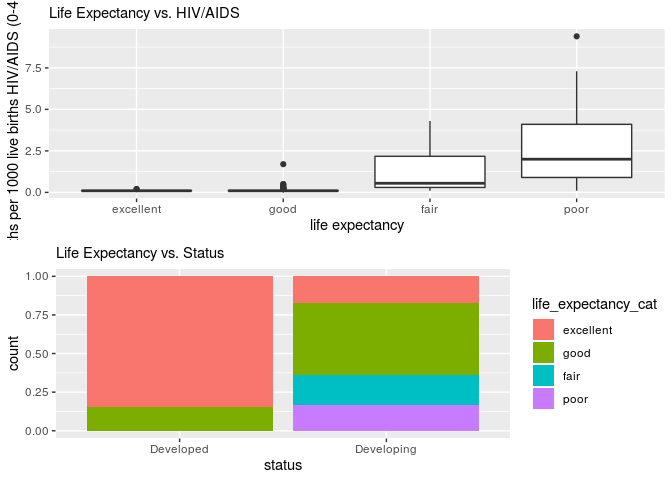
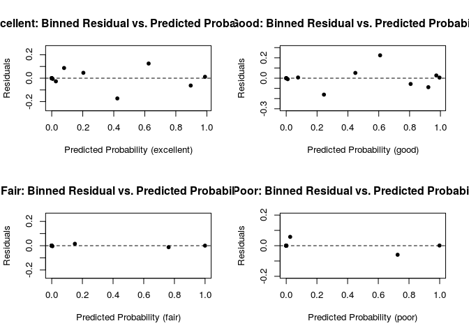

Life Expectancy Across Nations
================
Dressed to the 9’s
December 5, 2019

## Section 1: Introduction

Extensive research has been done to identify the many factors that
influence life expectancy, such as demographic variables, income
composition, and mortality rates. However, less research has surfaced
identifying causes such as immunizations, which is a very important
factor to consider when studying life expectancy due to the high
incidence of infectious disease leading to mortality and morbidity.

The health-related data in this dataset was collected by the Global
Health Observatory (GHO) data repository under World Health Organization
(WHO). The economic data for each country was first reported on the
United Nations website. The data attempts to identify significant
factors that may have an influence on a country’s life expectancy,
including information on nations’ immunization factors, mortality
factors, economic factors, and other health-related factors. Life
expectancy is reported in the data as the average age for each country.
We intend to use this data in order to discover how we can best predict
life expectancies across various countries. Therefore, countries can use
this information to determine what is most important for them to focus
on improving, in order to improve overall life expectancy.

Our aim is to investigate which characteristics are the best predictors
of life expectancy in a given country in the year 2014. We expect that
predictors involving data on a nation’s immunizations (predictor
variables Hepatitis B, HIV/AIDS, Polio, Diphtheria, and Measles) will be
more significant predictors of life expectancy for the year 2014, rather
than predictors involving mortality factors, economic factors, and other
health-related factors, because these predictors relate directly to the
burden of infectious diseases.

However, there may be a difference between the significance of
immunizations in developing countries versus developed countries where
most of the population is already vaccinated. We expect that in
developing countries, where there is a high burden of disease due to
infectious diseases, immunizations will be more significant predictors
of life expectancy than in developed countries, where the burden of
disease is concentrated in non-communicable diseases rather than
infectious diseases. To investigate this, we intend to explore the
potential relationship between the life expectancies of countries
classified as “developed” versus countries classified as “developing”
using ANOVA, and we expect to find a significant difference between
these two groups.

##### Exploratory Data Analysis

    ## Skim summary statistics
    ##  n obs: 183 
    ##  n variables: 23 
    ## 
    ## ── Variable type:character ───────────────────────────────────────────────
    ##  variable missing complete   n min max empty n_unique
    ##   country       0      183 183   4  52     0      183
    ##    status       0      183 183   9  10     0        2
    ## 
    ## ── Variable type:factor ──────────────────────────────────────────────────
    ##             variable missing complete   n n_unique
    ##  life_expectancy_cat       0      183 183        4
    ##                          top_counts ordered
    ##  goo: 75, exc: 53, fai: 30, poo: 25   FALSE
    ## 
    ## ── Variable type:numeric ─────────────────────────────────────────────────
    ##               variable missing complete   n        mean          sd
    ##        adult_mortality       0      183 183   148.69      106.03   
    ##                alcohol       1      182 183     3.27        4.16   
    ##                    bmi       2      181 183    41.03       21.11   
    ##             diphtheria       0      183 183    84.08       23.03   
    ##                    gdp      28      155 183 10015.57    18484.24   
    ##            hepatitis_b      10      173 183    83.12       23.36   
    ##               hiv_aids       0      183 183     0.68        1.39   
    ##  income_comp_resources      10      173 183     0.69        0.15   
    ##          infant_deaths       0      183 183    24.56       87.05   
    ##        life_expectancy       0      183 183    71.54        8.56   
    ##                measles       0      183 183  1831.21     8770.08   
    ##       perc_expenditure       0      183 183  1001.91     2553.29   
    ##                  polio       0      183 183    84.73       20.87   
    ##             population      41      142 183     2.1e+07     1.1e+08
    ##              schooling      10      173 183    12.89        2.91   
    ##         thinness_10_19       2      181 183     4.53        4.14   
    ##           thinness_5_9       2      181 183     4.68        4.25   
    ##      total_expenditure       2      181 183     6.2         2.74   
    ##      under_five_deaths       0      183 183    32.89      114.29   
    ##                   year       0      183 183  2014           0      
    ##       p0       p25        p50        p75         p100     hist
    ##     1        66        135        216.5     522       ▇▇▇▃▂▂▁▁
    ##     0.01      0.01       0.32       6.7      15.19    ▇▁▁▂▁▁▁▁
    ##     2        23.2       47.4       59.8      77.1     ▃▂▅▂▂▅▇▁
    ##     2        83         94         97        99       ▁▁▁▁▁▁▁▇
    ##    12.28    617.99    3154.51    8239.95 119172.74    ▇▁▁▁▁▁▁▁
    ##     2        79         93         97        99       ▁▁▁▁▁▁▁▇
    ##     0.1       0.1        0.1        0.4       9.4     ▇▁▁▁▁▁▁▁
    ##     0.34      0.57       0.72       0.8       0.94    ▂▃▃▃▃▇▅▅
    ##     0         0          2         18       957       ▇▁▁▁▁▁▁▁
    ##    48.1      65.6       73.6       76.85     89       ▁▂▃▃▃▇▃▁
    ##     0         0         13        316     79563       ▇▁▁▁▁▁▁▁
    ##     0        11.06     151.1      703.21  19479.91    ▇▁▁▁▁▁▁▁
    ##     8        80         94         97        99       ▁▁▁▁▁▁▂▇
    ##    41    286943.75 1567720    8080433         1.3e+09 ▇▁▁▁▁▁▁▁
    ##     4.9      10.8       13         14.9      20.4     ▁▂▅▅▇▆▂▁
    ##     0.1       1.5        3.3        6.6      26.8     ▇▃▂▁▁▁▁▁
    ##     0.1       1.5        3.4        6.6      27.4     ▇▃▂▁▁▁▁▁
    ##     1.21      4.48       5.84       7.74     17.14    ▃▆▇▆▂▁▁▁
    ##     0         0          3         22      1200       ▇▁▁▁▁▁▁▁
    ##  2014      2014       2014       2014      2014       ▁▁▁▇▁▁▁▁

In this analysis, we only use data for the year 2014. Our dataset
includes 183 observations and 22 columns. Each observation represents a
different world country. Later, we will filter out countries with
missing data to build the model.

<!-- -->

We created a categorical response variable out of the discrete variable
life\_expectancy, in order to create a multinomial logistic model. For
this new response variable, x \<= 60 years is poor, 60 \< x \<= 67 is
fair, 67 \< x \<= 76 is good, and x \> 76 is excellent. These thresholds
are chosen based on the distribution of life expectancy: the minimum to
25th percentile is 48.1 years to 65.6 years, informing our choice of 48
year to 60 years for poor. The 25th to 75th percentile is 65.6 to 76.5,
informing our choice of 61 years to 67 years for fair and 68 years to 76
years for good. Finally, the 75th percentile to maximum is 76.85 years
to 89 years, informing our choice of 77 years and above for excellent.

The average value of life\_expectancy was 71.54 years. From the plot, we
can see that out of the four levels of life\_expectancy\_cat, most
countries have life expectancies categorized as good.

Here are the univariate distributions of the variables we used in our
full model:

We would like to examine immunization coverage for Hepatitis B, Polio,
and Diphtheria. This is reported in terms of percent of 1-year-olds who
are immunized.

<!-- -->

From these histograms it is evident that in most countries, most
1-year-olds are immunized for these diseases. However, for all the
diseases there are still a few countries with almost a 0% immunization
coverage, which likely affects life expectancy.

We would like to investigate the two variables indicating prevalence of
thinness among children and adolescents in terms of a percent:
thinness\_5\_9 and thinness\_10\_19, and the schooling variable. These
three variables are childhood factors.

<!-- -->

Both of the distributions of thinness are right-skewed and are overall
very similar. Most countries in the dataset have a low percent of
children of either age group who are considered to be thin. Schooling is
unimodal, centered at 12.88728 years.

We will next examine three adulthood factors: alcohol, bmi and adult
mortality.

<!-- -->

Although many countries have a per capita consumption of 0.01 litres of
pure alcohol, those countries greater than 0.01 create a unimodal, more
symmetric distribution. The distribution of BMI is unusual and does not
follow the distributions for the thinness-related variables. There seems
to be three peaks, around 5, 25, and 60 BMI. This may be because there
are countries in which people are malnourished and starving, countries
in which people are healthy on average, and countries in which most
people are overweight. The distribution of adult mortality seems to be
centered roughly around 120 deaths age 15-60 per 1000 population.

Next, we will examine economic factors that affect life expectancy.

<!-- -->

Total\_expenditure has a fairly symmetric distribution and gives a
better understanding of the spending of health by country. The
distribution of GDP is very right-skewed, possibly because there are a
few very wealthy countries that are outliers.

We will now examine the remaining predictor variables in the data.

<!-- -->

Death from HIV/AIDS is such a rare event that this distribution is very
right-skewed. It is evident that a handful of countries have an
epidemic. Show by the second plot, it appears that there are many more
developing countries in our data than developed countries.

Here are the bivariate plots of the response variable
life\_expectancy\_cat versus the variables we will use in our full
model:

First, we will examine the bivariate relationships between the response
variable and the immunization variables: polio, hepatitis B, and
diptheria.

<!-- -->

Countries with all types of life expectancy are left skewed in terms of
Hepatitis B immunization coverage. It appears that “excellent” and
“good” countries have higher percent of 1-year-olds immunized than
“fair” and “poor” countries, as one might expect. The same appears to
be true for polio and diphtheria immunizations.

Next, we will examine childhood factors versus the response variable.

<!-- -->

From these plots, thinness from ages 5-9 and ages 10-19 seems to be more
prevalent in countries with fair to poor life expectancy.

It seems that as schooling decreases, life expectancy decreases.

Now, we will examine the adulthood factors versus the response variable.

<!-- -->

The boxplots indicate an increase in alcohol consumption as the quality
of life expectancy increases. For example, countries classified as
excellent have a much higher alcohol consumption than the others.

The average BMI boxplots appear to have a possible positive correlation
between life expectancy and average bmi.

These boxplots show a possible negative correlation between life
expectancy and adult mortality rates, as one might expect.

Now, we will examine the economic factors versus the response variable.

<!-- -->

From these boxplots, excellent and good appear to have a higher
percentage of total expenditure on health than fair and poor.

It appears that the countries with a high GDP per capita also tend to
have excellent life expectancy. This makes sense because both are
roughly a measure of the quality of life in a country.

We will now examine the remaining predictor variables in the data versus
the response variable.

<!-- -->

It appears that the majority of HIV/AIDS-related deaths occur in
countries with poor life expectancy.

In addition to this, it seems that developed countries have much more
classifications of excellent and no classifications of poor or fair,
which is to be expected.

We also used a pairs plot to investigate correlation between each of the
variables (excluding the categorical variable
status):

<!-- -->

From this pairs plot of death and disease-related predictor variables,
it is evident that hepatitis b and diphtheria are highly correlated.
Additionally, adult\_mortality and life\_expectancy seem to have a
strong negative correlation. These correlations corroborate what we
would expect – when one disease is prevalent in a country, it is likely
that others will be prevalent as well, and when adult mortality rates
are high, life expectancy decreases in turn.

<!-- -->

This pairs plot shows that thinness\_10\_19 and thinness\_5\_9 are
highly correlated. Thinness during ages 5 - 9 likely carries over into
ages 10 - 19. Schooling seems to be strongly positively correlated with
life expectancy as well – when citizens do not have to worry as much
about survival needs such as food, health, clean water, etc., they have
more opportunities and resources to attain a high level of education.

## Section 2: Regression Analysis

We used a multinomial logistic regression model to explore the effects
of each country characteristic on the probability that the given country
will have a certain category of life expectancy.

We chose this technique because we wanted to see the effects of multiple
variables on a categorical response with several levels – this could not
be accomplished by simple linear regression, multiple linear regression,
or logistic regression. We believe that when investigating countries
that are in need of global assistance, the exact life expectancy is not
required – rather, simply knowing if the life expectancy is very
low/high is sufficient for recognizing a struggling nation. Multinomial
logistic regression allows us to utilize quantitative characteristics of
different countries to predict an important categorical response.

To fit the model, we removed observations with missing values. This
reduced the number of observations from 183 to 144.

Our full model included the following variables (which were investigated
in the above EDA): status, adult mortality, alcohol, hepatitis B, BMI,
polio, total expenditure, diphtheria, HIV/AIDS, GDP, thinness 10-19
years, thinness 5-9 years, and schooling.

We performed backwards selection using AIC. We selected this criterion
because the AIC possesses a smaller penalty for unnecessary predictors
than the BIC. We were not concerned with finding the most parsimonious
model and instead wanted to prioritize the predictive ability of the
model.

We utilized the drop-in-deviance test to test the significance of three
interactions (between schooling and adult\_mortality, between
total\_expenditure and hiv\_aids, and between hiv\_aids and
hepatitis\_b). From these tests, we found the interaction between
hiv\_aids and hepatitis\_b to be significant and added it to our final
model.

    ## # weights:  40 (27 variable)
    ## initial  value 199.626388 
    ## iter  10 value 109.086842
    ## iter  20 value 91.378115
    ## iter  30 value 59.628320
    ## iter  40 value 47.763221
    ## iter  50 value 46.504596
    ## iter  60 value 45.805010
    ## iter  70 value 45.539623
    ## iter  80 value 44.947382
    ## iter  90 value 43.940983
    ## iter 100 value 43.826902
    ## final  value 43.826902 
    ## stopped after 100 iterations

| y.level | term                   |    estimate | std.error |     statistic |   p.value |    conf.low |   conf.high |
| :------ | :--------------------- | ----------: | --------: | ------------: | --------: | ----------: | ----------: |
| good    | (Intercept)            |   8.2875743 | 0.0061991 |  1336.8999881 | 0.0000000 |   8.2754242 |   8.2997243 |
| good    | hepatitis\_b           |   0.0182409 | 0.0168158 |     1.0847483 | 0.2780331 | \-0.0147175 |   0.0511993 |
| good    | thinness\_5\_9         |   0.1919056 | 0.0722708 |     2.6553675 | 0.0079222 |   0.0502574 |   0.3335538 |
| good    | total\_expenditure     | \-0.4261903 | 0.1243549 |   \-3.4272091 | 0.0006098 | \-0.6699215 | \-0.1824592 |
| good    | hiv\_aids              |   2.2816176 | 0.0011984 |  1903.8110756 | 0.0000000 |   2.2792686 |   2.2839665 |
| good    | gdp                    | \-0.0000781 | 0.0000283 |   \-2.7631748 | 0.0057242 | \-0.0001335 | \-0.0000227 |
| good    | schooling              | \-0.5776208 | 0.1002558 |   \-5.7614713 | 0.0000000 | \-0.7741185 | \-0.3811231 |
| good    | adult\_mortality       |   0.0220437 | 0.0065572 |     3.3617381 | 0.0007745 |   0.0091918 |   0.0348957 |
| good    | hepatitis\_b:hiv\_aids | \-0.0361437 | 0.0753796 |   \-0.4794898 | 0.6315902 | \-0.1838849 |   0.1115975 |
| fair    | (Intercept)            |  63.8828613 | 0.0048825 | 13083.9924032 | 0.0000000 |  63.8732918 |  63.8924309 |
| fair    | hepatitis\_b           |   0.0472106 | 0.0274485 |     1.7199679 | 0.0854383 | \-0.0065875 |   0.1010087 |
| fair    | thinness\_5\_9         | \-0.1827812 | 0.0813875 |   \-2.2458134 | 0.0247160 | \-0.3422977 | \-0.0232646 |
| fair    | total\_expenditure     | \-2.5608673 | 0.0223970 | \-114.3395375 | 0.0000000 | \-2.6047647 | \-2.5169700 |
| fair    | hiv\_aids              |  11.3412213 | 0.0195959 |   578.7533961 | 0.0000000 |  11.3028139 |  11.3796286 |
| fair    | gdp                    |   0.0000212 | 0.0000938 |     0.2256587 | 0.8214669 | \-0.0001627 |   0.0002050 |
| fair    | schooling              | \-5.2484412 | 0.0483688 | \-108.5088868 | 0.0000000 | \-5.3432422 | \-5.1536401 |
| fair    | adult\_mortality       |   0.0010666 | 0.0098780 |     0.1079727 | 0.9140173 | \-0.0182939 |   0.0204270 |
| fair    | hepatitis\_b:hiv\_aids |   0.1685359 | 0.0914053 |     1.8438308 | 0.0652078 | \-0.0106152 |   0.3476869 |
| poor    | (Intercept)            |  10.0827566 | 0.0047379 |  2128.1238013 | 0.0000000 |  10.0734706 |  10.0920427 |
| poor    | hepatitis\_b           |   0.0747965 | 0.0398054 |     1.8790548 | 0.0602370 | \-0.0032206 |   0.1528135 |
| poor    | thinness\_5\_9         |   1.1660378 | 0.0778436 |    14.9792459 | 0.0000000 |   1.0134673 |   1.3186084 |
| poor    | total\_expenditure     | \-0.8331704 | 0.0093955 |  \-88.6777514 | 0.0000000 | \-0.8515852 | \-0.8147556 |
| poor    | hiv\_aids              |  17.9049505 | 0.0198124 |   903.7224465 | 0.0000000 |  17.8661188 |  17.9437822 |
| poor    | gdp                    | \-0.0062363 | 0.0007231 |   \-8.6242239 | 0.0000000 | \-0.0076535 | \-0.0048190 |
| poor    | schooling              | \-4.4798589 | 0.0505666 |  \-88.5932897 | 0.0000000 | \-4.5789675 | \-4.3807502 |
| poor    | adult\_mortality       |   0.1060784 | 0.0125755 |     8.4353345 | 0.0000000 |   0.0814309 |   0.1307259 |
| poor    | hepatitis\_b:hiv\_aids |   0.1051510 | 0.0915840 |     1.1481364 | 0.2509122 | \-0.0743504 |   0.2846524 |

### Model Assumptions and Diagnostics

We utilized binned average residual plots and a correlation matrix to
analyze model fit and multicollinearity.

##### Binned Residuals vs. Predicted Probabilities

<!-- -->

These plots show binned residuals versus their predicted probabilities
for each level of life\_expectancy\_cat. All of the plots seem to
satisfy multinomial logistic model assumptions because they are not
fan-shaped and are scattered both above and below 0 fairly evenly.

**Binned Residuals vs. Predictors**

Now, we will plot the binned model residuals versus each quantitative
predictor for each category of life\_expectancy\_cat (excellent, good,
fair, poor).

##### hepatitis\_b

<!-- -->

From the plots of binned residuals vs. hepatitis\_b for each category of
life\_expectancy\_cat (excellent, good, fair, poor), we can see that the
residuals are all approximately scattered around a mean of 0, and there
is no apparent nonlinear pattern. These plots do not violate model
assumptions.

##### thinness\_5\_9

<!-- -->

From the plots of binned residuals vs. thinness\_5\_9 for each category
of life\_expectancy\_cat (excellent, good, fair, poor), we can see that
the residuals are all approximately scattered around a mean of 0, and
there is no apparent nonlinear pattern. These plots do not violate model
assumptions.

##### gdp

<!-- -->

From the plots of binned residuals vs. gdp for each category of
life\_expectancy\_cat (excellent, good, fair, poor), we can see that the
residuals are all approximately scattered around a mean of 0, and there
is no apparent nonlinear pattern. These plots do not violate model
assumptions.

##### diphtheria

<!-- -->

From the plots of binned residuals vs. diphtheria for each category of
life\_expectancy\_cat (excellent, good, fair, poor), we can see that the
residuals are all approximately scattered around a mean of 0, and there
is no apparent nonlinear pattern. These plots do not violate model
assumptions.

##### total\_expenditure

<!-- -->

From the plots of binned residuals vs. total\_expenditure for each
category of life\_expectancy\_cat (excellent, good, fair, poor), we can
see that the residuals are all approximately scattered around a mean of
0, and there is no apparent nonlinear pattern. These plots do not
violate model assumptions.

##### schooling

<!-- -->

From the plots of binned residuals vs. schooling, categories excellent
and good appear slightly curved (possibly cubic for excellent, and
possibly quadratic for good). However, these are not strong
deviations/curves – they may be the result of bin size or other factors,
so they do not seem significant enough to violate our model assumptions.
For fair and poor, we can see that the residuals are all approximately
scattered around a mean of 0, and there is no apparent nonlinear
pattern. These plots do not violate model assumptions.

##### adult\_mortality

<!-- -->

From the plots of binned residuals vs. adult\_mortality\_rate for each
category of life\_expectancy\_cat (excellent, good, fair, poor), we can
see that the residuals are all approximately scattered around a mean of
0, and there is no apparent nonlinear pattern. These plots do not
violate model assumptions.

##### hiv\_aids

<!-- -->

From the plots of binned residuals vs. hiv\_aids for each category of
life\_expectancy\_cat (excellent, good, fair, poor), we can see that the
residuals are all approximately scattered around a mean of 0, and there
is no apparent nonlinear pattern. These plots do not violate model
assumptions.

##### Multicollinearity

To analyze multicollinearity, we will examine a correlation plot between
all numeric variables in the
    model.

    ##                   hepatitis_b thinness_5_9 total_expenditure    hiv_aids
    ## hepatitis_b        1.00000000  -0.04055399        0.08089199 -0.20257984
    ## thinness_5_9      -0.04055399   1.00000000       -0.26494220  0.15530630
    ## total_expenditure  0.08089199  -0.26494220        1.00000000 -0.08125208
    ## hiv_aids          -0.20257984   0.15530630       -0.08125208  1.00000000
    ## gdp                0.16274668  -0.24835855        0.03142696 -0.17985235
    ## schooling          0.27997458  -0.49235285        0.29190539 -0.39671783
    ## adult_mortality   -0.22962864   0.28140600       -0.10180996  0.65319822
    ##                           gdp  schooling adult_mortality
    ## hepatitis_b        0.16274668  0.2799746      -0.2296286
    ## thinness_5_9      -0.24835855 -0.4923528       0.2814060
    ## total_expenditure  0.03142696  0.2919054      -0.1018100
    ## hiv_aids          -0.17985235 -0.3967178       0.6531982
    ## gdp                1.00000000  0.4017589      -0.3045176
    ## schooling          0.40175890  1.0000000      -0.5818254
    ## adult_mortality   -0.30451757 -0.5818254       1.0000000

From the correlation plot, we see that most correlation coefficients
have magnitudes less than 0.3, indicating no strong concerns with highly
correlated variables. There is a coefficient of 0.65319822 between
adult\_mortality and hiv\_aids, which is a bit higher than the others –
this can be somewhat expected, as countries with higher rates of HIV and
AIDS are likely to have higher adult mortality rates. However, this
correlation is not strong, so we will leave the variables in the model.

Also, schooling has coefficients of -0.49235285 and -0.5818254 with
thinness\_5\_9 and adult\_mortality, respectively. As with
adult\_mortality and hiv\_aids, it is not surprising that as adult
mortality and malnourishment increase, the amount of schooling citizens
can attain decreases. Again, while somewhat notable, these coefficients
are not too large, so we will leave the variables in the model. Overall,
the correlation coefficients do not indicate any highly correlated
variables, so we do not have concerns about multicollinearity.

##### Independence

The independence assumption may not be satisfied within our dataset.
Neighboring countries are likely to share similar characteristics,
including environment, resources, disease prevalence, and more.
Therefore, there may be spatial correlation between the observations,
i.e., observations in similar regions (Central Africa, East Asia, North
America, etc.) may have similar life expectancies. Countries also often
share resources through trade and immigration, so citizens and resources
of one country are likely to influence those of neighboring countries.
We will proceed with our analysis without accounting for country
location, but in future research, this should be addressed by creating a
variable to account for a country’s region.

##### Assumptions Conclusion

Because the plots of residuals vs. predicted probabilities and residuals
vs. predictors display no nonlinear trends and there are no high
correlation coefficients between variables, we have concluded that the
model sufficiently meets the necessary assumptions, and it is an
appropriate model fit for the dataset.

### Model Prediction

##### Actual Vs. Predicted

We will have our model predict a life expectancy category for each
observation and compare with the observation’s actual category.

    ## # A tibble: 4 x 5
    ##   life_expectancy_cat excellent  good  fair  poor
    ##   <fct>                   <int> <int> <int> <int>
    ## 1 excellent                  32     7     0     0
    ## 2 good                        5    55     1     0
    ## 3 fair                        0     0    22     1
    ## 4 poor                        0     0     1    20

The misclassification rate is fairly low for this model, only 10.41667
percent. This indicates that our model is largely effective at
successfully determining the life expectancy category (excellent, good,
fair, poor) for various countries.

## Section 3: Discussion and Limitations

From our model selection, we found that the variables Hepatitis B,
thinness from ages 5-9, total expenditure, HIV/AIDS, GDP, schooling,
adult mortality, and the interaction between HIV/AIDS and Hepatitis B
were the best predictors of life expectancy in different countries.

To test the model’s predictive power, we used it to calculate the
predicted life expectancy of Sudan and the US, which were not included
in the data used to build the model because of their missing values.
Unfortunately, the Sudan observation is missing thinness\_5\_9 and the
US observation is missing schooling and gdp, which were variables
included in the final model. Therefore, we used mean imputation to fill
these missing values with the mean value from the lifedata dataset used
for the EDA (after filtering for 2014). Since Sudan’s reported life
expectancy is 63.8 and the US’s is 79.1, they would be categorized as
fair and excellent, respectively. These reported categorizations match
the predicted categorizations from the model.

    ## [1] fair
    ## Levels: excellent good fair poor

    ## [1] excellent
    ## Levels: excellent good fair poor

One thing we found interesting was the coefficients for
thinness\_5\_9.For each additional percent of children ages 5-9 who are
considered thin, the odds of the country having a good life expectancy
classification are 1.2116 times the odds of the country having an
excellent life expectancy classification. However, for each additional
percent of children ages 5-9 who are considered thin, the odds of the
country having a fair life expectancy classification are 0.8330 times
the odds of the country having an excellent life expectancy
classification. And, for each additional percent of children ages 5-9
who are considered thin, the odds of the country having a poor life
expectancy classification are 3.2093 times the odds of the country
having an excellent life expectancy classification.These coefficients
show that the prevalence of child thinness has the most effect on life
expectancy between the classifications of poor and excellent countries,
as we would expect.

We also wanted to discuss the differences in adult mortality rate
between the different classifications of life expectancy. For each
additional death age 15-60 per 1000 population, the odds of the country
having a good life expectancy classification are 1.0223 times the odds
of the country having an excellent life expectancy classification. For
each additional death age 15-60 per 1000 population, the odds of the
country having a fair life expectancy classification are 1.0011 times
the odds of the country having an excellent life expectancy
classification. For each additional death age 15-60 per 1000 population,
the odds of the country having a poor life expectancy classification are
1.1119 times the odds of the country having an excellent life expectancy
classification. Because adult mortality is so similar to life
expectancy, an additional death age 15-60 per 1000 population has a very
similar effect on the odds of the country having a good, fair, or poor
life expectancy as opposed to an excellent one, although it has the
largest effect on a poor versus an excellent one.

One issue with the data that we came across was the possibility of a
high correlation with certain observations. We were most worried about
observations based on developed/developing. Due to this, we plotted the
confidence intervals and did a pairwise confidence interval for the
difference between mean life expectancies in developed and developing
countries. We found that the interval did not include 0 and therefore
that there is a significant difference between mean life expectancies in
developed and developing countries. In addition to this, it is possible
that neighboring countries could be correlated/affect one another. To
explore this possible relation if we were going to continue working on
this project, we might try to create a regions variable. This way, the
surrounding countries would be grouped together and compared to other
regions that are more likely to not be closely related. In order to do
this we would have to do research to figure out how to characterize each
region and which countries to include.

If we were to start over, we might take a more research based approach
to choosing the thresholds for the categorical version of life
expectancy. Initially, we chose categories of approximately the same
size of life expectancy points but found the proportion of observations
in these categories were extremely different and we thought this might
have a negative effect on our regression. As a result we altered the
thresholds a bit to create categories that had more similar proportions
of observations. Instead, we could have done research and found a
reputable source that characterized life expectancies into categories so
that we had research to back up our thresholds. In addition to this, our
original model had predictors that were log transformed based on the
univariate plots. We realize this was incorrect and refit the model
using the natural versions of the predictors as opposed to the log
transformations.

## Section 4: Conclusion

In our project, we wanted to test how to best predict life expectancy
across various countries. We used started with data and a list of
variables from the Global Health Observatory (GHO) that covers 193
countries. The data attempts to identify significant factors that may
have an influence on a country’s life expectancy, including information
on nations’ immunization factors, mortality factors, economic factors,
and other health-related factors. We built a model using multinomial
regression that identified which predictors from the data are the most
significant predictors of a nation’s life expectancy in the year 2014.

First, we created a new categorical variable to classify life
expectancy: 48 years to 60 years will be considered poor, 61 years to 67
years will be considered fair, 68 years to 76 years will be considered
good, and 77 years to 90 years will be considered excellent. We used a
multinomial logistic regression model to explore the effects of each
country characteristic on the probability that a given country will have
a certain category of life expectancy in 2014. We began by creating the
full model, with all possible variables that we are considering as
potentially significant to life expectancy category: status, adult
mortality, alcohol, Hepatitis B, BMI, Polio, total expenditure,
diphtheria, HIV/AIDS, GDP, thinness 10-19 years, thinness 5-9 years, and
schooling. To improve the model, we used backwards selection based on
AIC. After choosing the model with the lowest AIC, we checked the model
assumptions, tested some interactions, and was left with our final
model. We found that the variables Hepatitis B, thinness from ages 5-9,
total expenditure, HIV/AIDS, GDP, schooling, adult mortality, and the
interaction between HIV/AIDS and Hepatitis B were the best predictors of
life expectancy in different countries.

We also explored the difference in life expectancy in developing
countries versus developed countries, using ANOVA. We checked the
assumptions and conducted the analysis of variance test. We found that
the mean life expectancy of developed countries is significantly
different from the mean life expectancy of developing countries. To
reinforce this finding, we plotted confidence intervals and constructed
pairwise confidence intervals to further investigate this difference.
From the plotted confidence intervals, it was apparent that mean life
expectancies differ greatly between developed and developing countries.
Developed countries have, on average, much higher life expectancies, and
developing countries have much lower life expectancies on average. The
95% pairwise confidence interval for the difference between mean life
expectancies in developed and developing countries did not include zero
so we concluded that there is a significant difference between mean life
expectancies in developed and developing countries.

## Section 5: Additional Work

#### Possible Interactions

We examined possible interaction effects between the predictor variables
in our final model that we suspected may have significant interactions.
In order to test these, we used drop-in-deviance tests to compare the
model selected by AIC to new models with an added interaction.

First, we examined the potential interaction effect between schooling
and adult mortality, because we suspected these two may have a
significant interaction.

    ## # weights:  44 (30 variable)
    ## initial  value 199.626388 
    ## iter  10 value 140.630676
    ## iter  20 value 109.189480
    ## iter  30 value 67.689989
    ## iter  40 value 46.668467
    ## iter  50 value 43.213250
    ## iter  60 value 42.234304
    ## iter  70 value 42.152471
    ## iter  80 value 41.904396
    ## iter  90 value 41.683063
    ## iter 100 value 41.553395
    ## final  value 41.553395 
    ## stopped after 100 iterations

| Model                                                                                                                                            | Resid. df | Resid. Dev | Test   | Df | LR stat. | Pr(Chi) |
| :----------------------------------------------------------------------------------------------------------------------------------------------- | --------: | ---------: | :----- | -: | -------: | ------: |
| hepatitis\_b + thinness\_5\_9 + total\_expenditure + hiv\_aids + gdp + schooling + adult\_mortality + hiv\_aids \* hepatitis\_b                  |       405 |     87.654 |        | NA |       NA |      NA |
| hepatitis\_b + thinness\_5\_9 + gdp + diphtheria + total\_expenditure + schooling + adult\_mortality + hiv\_aids + schooling \* adult\_mortality |       402 |     83.107 | 1 vs 2 |  3 |    4.547 |   0.208 |

Since the p-value from this drop-in-deviance test, 0.208, is larger than
0.05, we concluded that there is not a significant interaction effect
between schooling and adult mortality.

Next, we examined the potential interaction between total expenditure
and hiv/aids.

    ## # weights:  44 (30 variable)
    ## initial  value 199.626388 
    ## iter  10 value 119.519809
    ## iter  20 value 92.460401
    ## iter  30 value 61.040356
    ## iter  40 value 46.964823
    ## iter  50 value 45.315999
    ## iter  60 value 45.124467
    ## iter  70 value 44.850160
    ## iter  80 value 44.227580
    ## iter  90 value 43.753904
    ## iter 100 value 43.703520
    ## final  value 43.703520 
    ## stopped after 100 iterations

| Model                                                                                                                                              | Resid. df | Resid. Dev | Test   | Df | LR stat. | Pr(Chi) |
| :------------------------------------------------------------------------------------------------------------------------------------------------- | --------: | ---------: | :----- | -: | -------: | ------: |
| hepatitis\_b + thinness\_5\_9 + total\_expenditure + hiv\_aids + gdp + schooling + adult\_mortality + hiv\_aids \* hepatitis\_b                    |       405 |     87.654 |        | NA |       NA |      NA |
| hepatitis\_b + thinness\_5\_9 + gdp + diphtheria + total\_expenditure + schooling + adult\_mortality + hiv\_aids + hiv\_aids \* total\_expenditure |       402 |     87.407 | 1 vs 2 |  3 |    0.247 |    0.97 |

Since the p-value from this drop-in-deviance test, 0.97, is super large,
we can conlcude that there is not a significant interaction effect
between hiv/aids and total expenditure.

Lastly, we examined the potential interaction between hepatitis B and
hiv/aids.

    ## # weights:  44 (30 variable)
    ## initial  value 199.626388 
    ## iter  10 value 108.370791
    ## iter  20 value 89.863455
    ## iter  30 value 60.835776
    ## iter  40 value 42.827062
    ## iter  50 value 39.772874
    ## iter  60 value 39.012760
    ## iter  70 value 38.935327
    ## iter  80 value 38.609292
    ## iter  90 value 38.502589
    ## iter 100 value 38.444713
    ## final  value 38.444713 
    ## stopped after 100 iterations

| Model                                                                                                                                        | Resid. df | Resid. Dev | Test   | Df | LR stat. | Pr(Chi) |
| :------------------------------------------------------------------------------------------------------------------------------------------- | --------: | ---------: | :----- | -: | -------: | ------: |
| hepatitis\_b + thinness\_5\_9 + total\_expenditure + hiv\_aids + gdp + schooling + adult\_mortality + hiv\_aids \* hepatitis\_b              |       405 |     87.654 |        | NA |       NA |      NA |
| hepatitis\_b + thinness\_5\_9 + gdp + diphtheria + total\_expenditure + schooling + adult\_mortality + hiv\_aids + hiv\_aids \* hepatitis\_b |       402 |     76.889 | 1 vs 2 |  3 |   10.764 |   0.013 |

Since the p-value from this drop-in-deviance test, 0.013, is smaller
than 0.05, we concluded that there is a significant interaction effect
between hiv/aids and hepatitis B and added this interaction to our
model.

**ANOVA Between Developed and Developing Countries**

We performed an ANOVA test to examine whether or not life expectancy
differs significantly between developed and developing countries. First,
we checked model assumptions for ANOVA.

##### Normality

<!-- -->

From the boxplot, it appears that life expectancy is approximately
normally distributed in each group. The tails of each boxplot appear
roughly even. The medians of the plots seem a bit right-skewed,
indicating that there may be a few more data points in the higher range
of life expectancies in each group. However, the plots are approximately
symmetric, indicating that normality is satisfied.

##### Constant Variance

    ## # A tibble: 2 x 5
    ##   status     n_color  mean   var median
    ##   <chr>        <int> <dbl> <dbl>  <dbl>
    ## 1 Developed       32  81.1  17.3   81.6
    ## 2 Developing     151  69.5  61.5   71.4

There may be some concerns with constant variance, as the number of
observations in each group is are not equal. There are about five times
as many developing countries as developed countries. However, the
highest variance of 61.51113 is not more than four times the smallest
variance of 17.32113. Although there are very different numbers of
observations in each group, the variances do not differ enough to cause
concern, so we will proceed with the ANOVA test despite some slight
issues with the constant variance assumption.

##### Independence

The independence assumption appears essentially satisfied. Within one
group (Developed or Developing), the life expectancy of one country
should not affect that of another country. Between groups, the life
expectancy of a developing country should not effect that of a developed
country. Developed countries may be able to influence nearby developing
countries with sharing of wealth or resources, raising life expectancy.
Developing countries may influence the life expectancy of nearby
developed countries if they export resources used by developed
countries, which may raise life expectancy. Relationships between
countries are not explained by the dataset, so we will proceed as if
independence is satisfied, although a more comprehensive analysis may be
suitable for future research.

**Analysis of Variance**

| term      |  df |    sumsq |     meansq | statistic | p.value |
| :-------- | --: | -------: | ---------: | --------: | ------: |
| status    |   1 | 3574.760 | 3574.76030 |  66.26961 |       0 |
| Residuals | 181 | 9763.624 |   53.94268 |        NA |      NA |

With an F statistic of 66.26961 and a p-value of ~0, we concluded that
the mean life expectancy of developed countries is significantly
different from the mean life expectancy of developing countries. We also
plotted confidence intervals and constructed pairwise confidence
intervals to investigate this difference.

**Plot Confidence Intervals**

Bonferroni correction: 1 - (0.05/2) = 0.975

Cumulative confidence level = 1- ((1-0.975)/2) = 0.9875

<!-- -->

From the plotted confidence intervals, it is apparent that mean life
expectancies differ greatly between developed and developing countries.
Developed countries have, on average, much higher life expectancies, and
developing countries have much lower life expectancies on average. The
range of the confidence interval for developed countries is slightly
wider than that of the interval for developing countries, but there is
no overlap between the intervals. We also examined a pairwise confidence
interval, below.

**Pairwise Confidence Interval**

    ##   
    ## 97.5 %-confidence intervals 
    ##  Method:  Difference of means assuming Normal distribution and equal variances 
    ##   
    ##   
    ##                      estimate  lower  upper
    ## Developing-Developed   -11.64 -14.87 -8.405
    ##   
    ## 

The 95% pairwise confidence interval for the difference between mean
life expectancies in developed and developing countries is (-14.87,
-8.405). Since this interval does not include 0, we concluded that there
is a significant difference between mean life expectancies in developed
and developing countries.
